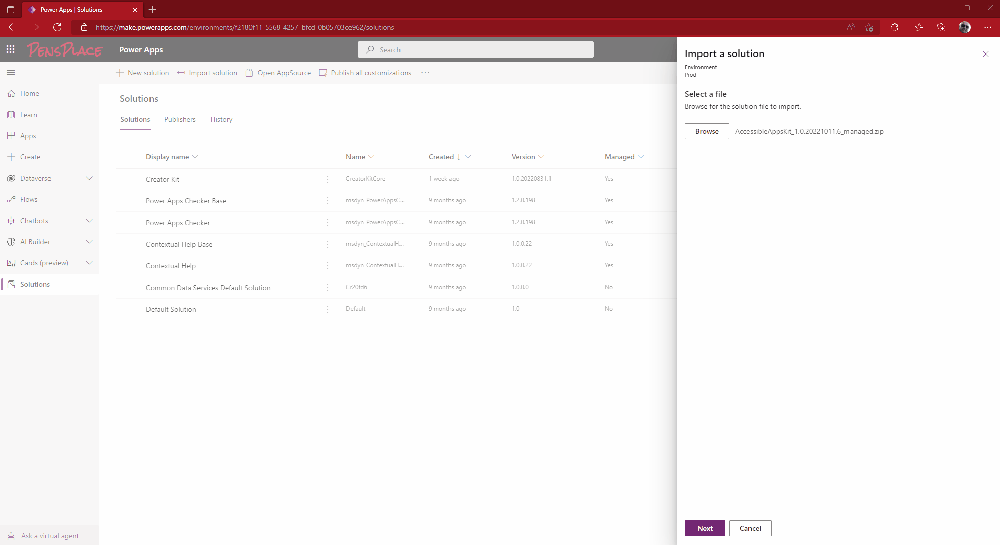
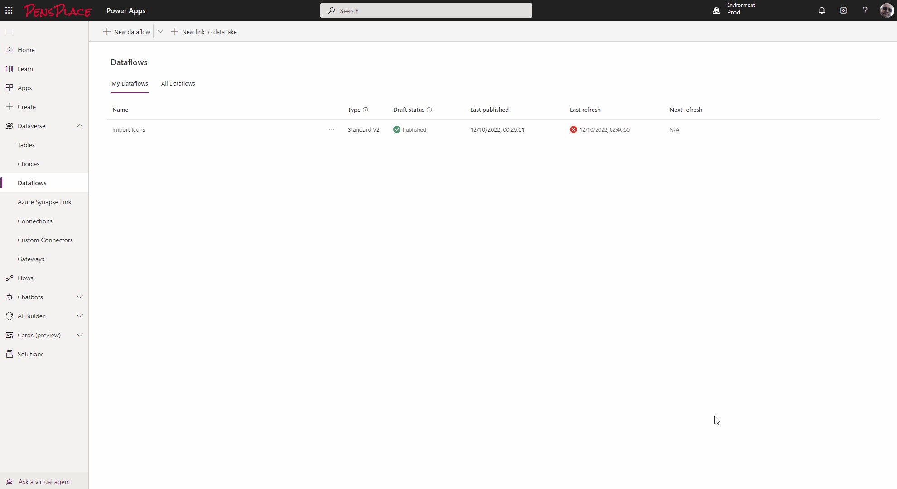

## Install Procedure

1. Configure the Power Platform Environment for code components
2. Install the Creator Kit - requires August 2022 release pre-installed.

:::note
September 2022 creator kit may fail to install if the August release is not installed first.
:::

3. Import the AccesibleAppsKit solution to an environment with Dataverse



4. Copy the empty ```icons.csv``` to OneDrive.

5. Configure the Dataflow


