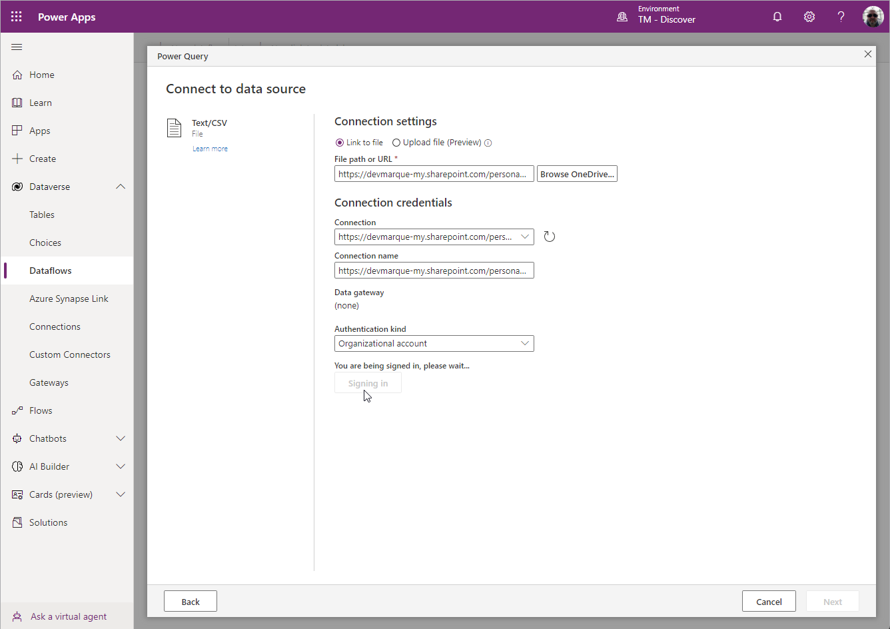
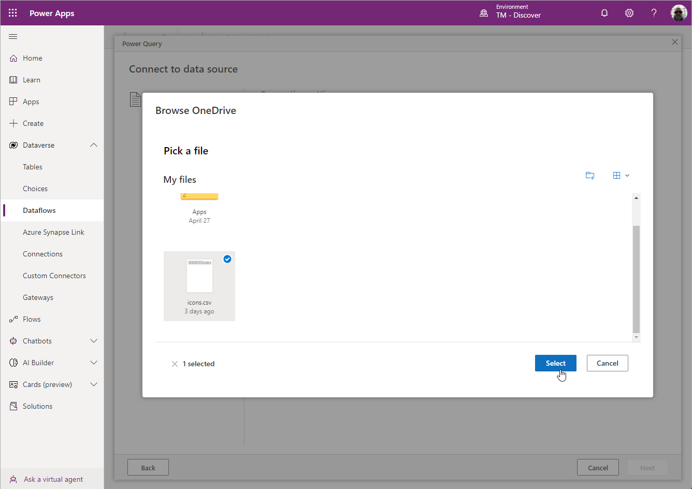
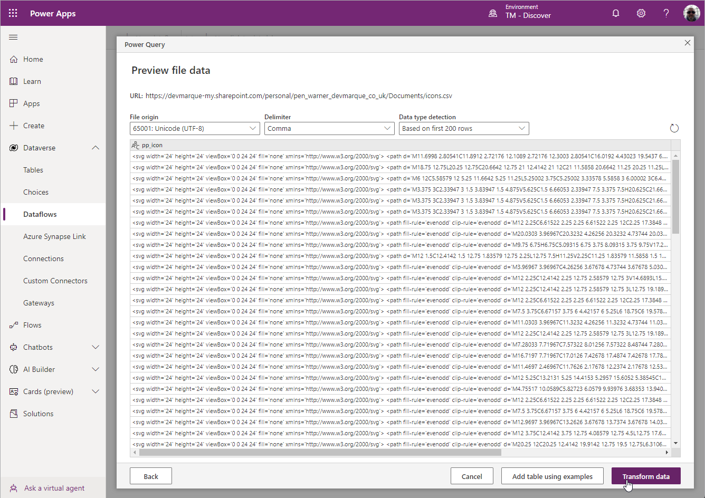
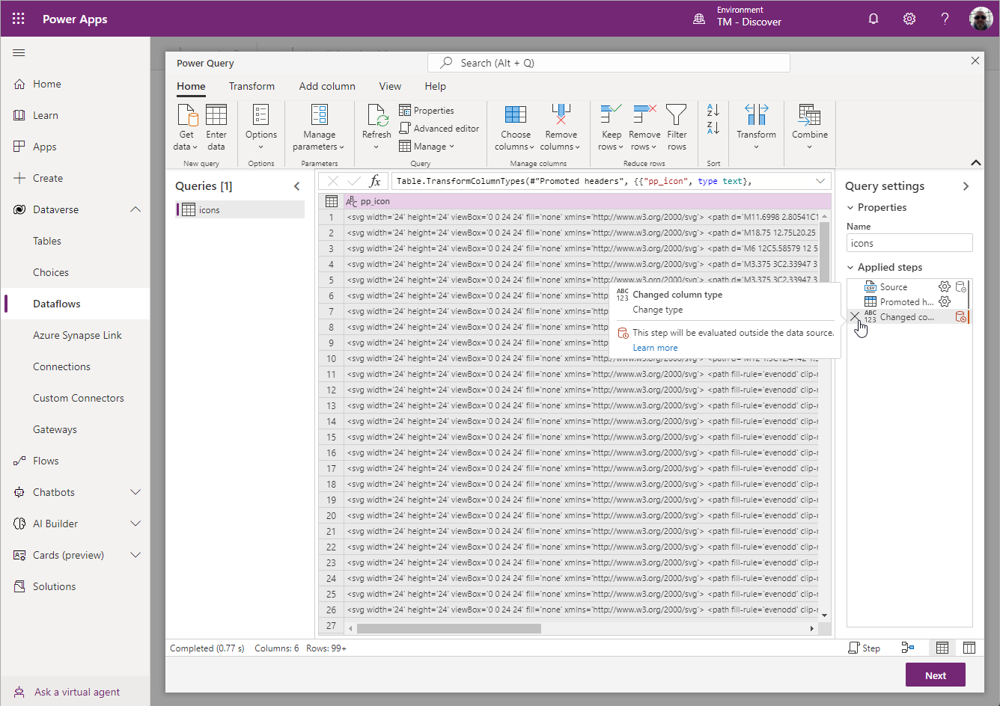
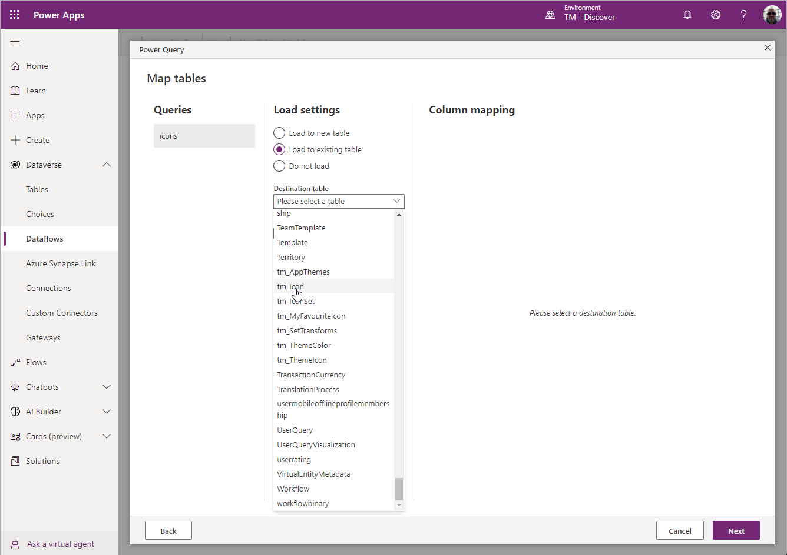

# Configure the **Load Icon Set** Dataflow.

First copy the **Icons.csv** from the root on the extracted zipfile to OneDrive, this will be the file the dataflow is configure to use when importing Icon Sets.  For each Icon set replace this file with the created Icons.csv for that set then configure in the app.

Open make.powerapps.com and navigate to the environment you have installed the solution into.

Click on ```Dataverse --> Dataflows``` and edit the Import Icons dataflow,




