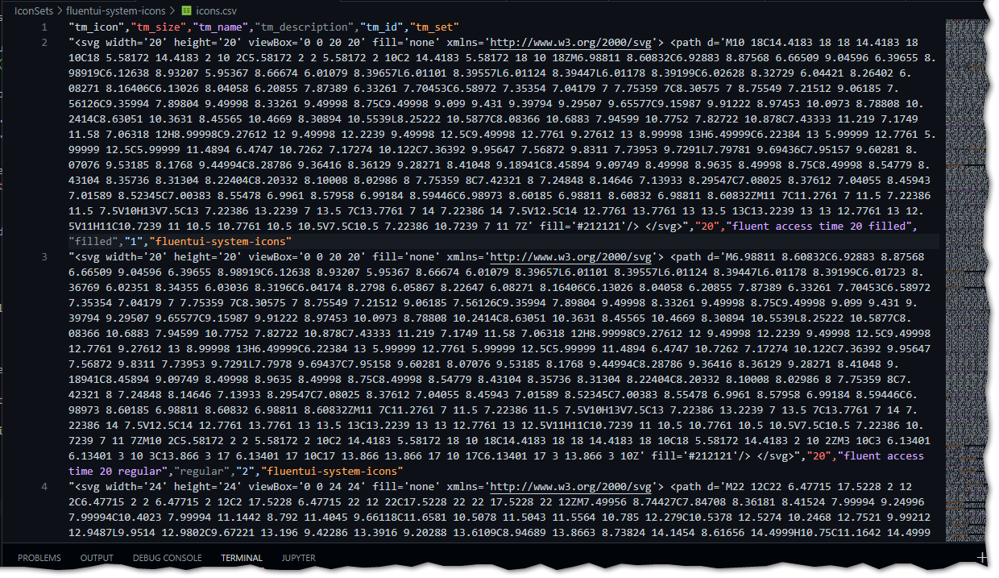
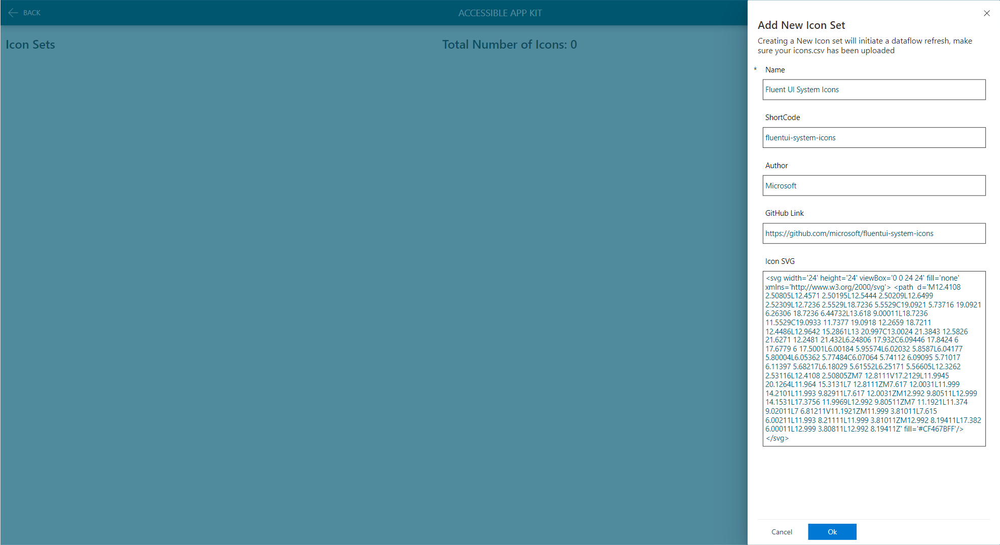

# Loading Icon Sets

Icons are loaded into the solution using the Icons.csv which for each icon set should be uploaded to your onedrive or whereever you have configured the dataflow to use.

## Loading Process


:::caution

Each Icon set requires its own Icons.CSV and needs to be replaced on onedrive each time you load a set.

:::

## Clone a Repository of Icons

:::info
The following example loads the FluentUI Systems Icons, you can create any Icon set you wish just follow the same procedure, some popular sets are detailed on the Icon Sets Page.
:::

Our first thing to do is get some icons, you can pretty much use any repo on Github that contains SVG icons, in the following example we will load the Fluent UI System Icons from the the repository on [Github](https://github.com/microsoft/fluentui-system-icons), clone the repository to a local directory.

Open a folder where you want to download to, and use the command ```git clone https://github.com/microsoft/fluentui-system-icons``` (you will need Git installed.)

## Create the Icons.csv file

Once you have cloned the repository run the following Power Shell to create the **Icons.CSV** file:

```powershell
# Fluent UI - 
# Create CSV for Import from GitHub Repo
# https://github.com/microsoft/fluentui-system-icons.git

$counter = 1
$setName = "fluentui-system-icons"
$file = "./icons.csv"
# Update the path to where you have cloned the repo
$path = "./IconSets/fluentui-system-icons/assets/*.svg" 

$icons = get-childitem -File $path -recurse
ForEach($icon in $icons){
    [string]$string = Get-Content $icon.FullName
    $trimmedFileName = $icon.Name.Replace("ic_fluent","").Replace(".svg","").Split("_")
    $splitNumber = $trimmedFileName.Count
    $objResults = New-Object PSObject -Property @{
        pp_id = $counter;
        pp_name = $icon.Name.Replace("ic_","").Replace("_"," ").Replace(".svg","");
        pp_icon = $string.Replace("""","'");
        pp_set = $setName
        pp_description =  $trimmedFileName[$splitNumber -1]
        pp_size =  $trimmedFileName[$splitNumber -2]
    }
    $counter++
    $objResults | Export-CSV $file -Append -NoTypeInformation -force
}

```

The CSV file should have the following columns:

| Column Name | Description |
|--------:|---------|
|* tm_id   | The id of the icon within the set, should start at 1 for each Icon Set. |
|* tm_name |  Name of the icon.|
|* tm_icon | The SVG code of the icon in text, the solution requires all ```"``` to be replaced with ```'```|
|* tm_set  | The Icon set shortcode, this must match the icon set shortcode.
|  tm_description | A description of the icon|
|  tm_size    | Size in Pixels|

  \* = required

Your csv should look like the following:



Upload the ```icons.csv``` to the location you configured the Dataflow to use, overwriting the existing file.

In the app on the home screen click the settings icon in the top right to Navigate to the 'Icon Set Admin Screen', click the ```+ New Icon Set``` button and complete the form as follows:

| Column Name | Value |
|--------|---------|
| Name   | Fluent UI System Icons|
| ShortCode | fluentui-system-icons|
| Author | Microsoft |
| Github Link | https://github.com/microsoft/fluentui-system-icons |
| Icon SVG | ```<svg width='24' height='24' viewBox='0 0 24 24' fill='none' xmlns='http://www.w3.org/2000/svg'> <path  d='M12.4108 2.50805L12.4571 2.50195L12.5444 2.50209L12.6499 2.52309L12.7236 2.5529L18.7236 5.5529C19.0921 5.73716 19.0921 6.26306 18.7236 6.44732L13.618 9.00011L18.7236 11.5529C19.0933 11.7377 19.0918 12.2659 18.7211 12.4486L12.9642 15.2861L13 20.997C13.0024 21.3843 12.5826 21.6271 12.2481 21.432L6.24806 17.932C6.09446 17.8424 6 17.6779 6 17.5001L6.00184 5.95574L6.02032 5.8587L6.04177 5.80004L6.05362 5.77484C6.07064 5.74112 6.09095 5.71017 6.11397 5.68217L6.18029 5.61552L6.25171 5.56605L12.3262 2.53116L12.4108 2.50805ZM7 12.8111V17.2129L11.9945 20.1264L11.964 15.3131L7 12.8111ZM7.617 12.0031L11.999 14.2101L11.993 9.82911L7.617 12.0031ZM12.992 9.80511L12.999 14.1531L17.3756 11.9969L12.992 9.80511ZM7 11.1921L11.374 9.02011L7 6.81211V11.1921ZM11.999 3.81011L7.615 6.00211L11.993 8.21111L11.999 3.81011ZM12.992 8.19411L17.382 6.00011L12.999 3.80811L12.992 8.19411Z' fill='#CF467BFF'/> </svg>``` |

Click OK, once the Icon Set is saved the Power Automate flow will trigger a refresh of the dataflow loading the icons into the Dataverse.
