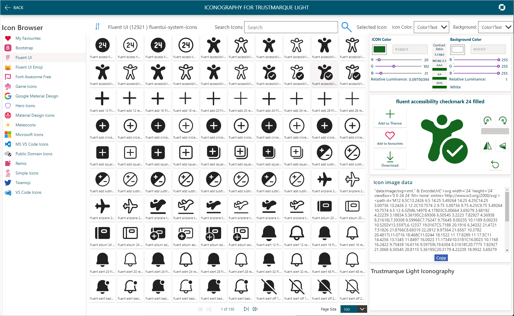

# Loading Fluent UI System Icons


Clone the repository from [Github](https://github.com/microsoft/fluentui-system-icons) in to the IconSets folder.

Run the following PowerShell script to create the Icons.csv.

```powershell
# Fluent UI - 
# Create CSV for Import from GitHub Repo
# https://github.com/microsoft/fluentui-system-icons.git

$counter = 1
$setName = "fluentui-system-icons"
$file = "./fluentui-system-icons.csv"
$path = "./IconSets/fluentui-system-icons/assets/*.svg"

$icons = get-childitem -File $path -recurse
ForEach($icon in $icons){
    [string]$string = Get-Content $icon.FullName
    $trimmedFileName = $icon.Name.Replace("ic_fluent","").Replace(".svg","").Split("_")
    $splitNumber = $trimmedFileName.Count
    $objResults = New-Object PSObject -Property @{
        tm_id = $counter;
        tm_name = $icon.Name.Replace("ic_","").Replace("_"," ").Replace(".svg","");
        tm_icon = $string.Replace("""","'");
        tm_set = $setName
        tm_description =  $trimmedFileName[$splitNumber -1]
        tm_size =  $trimmedFileName[$splitNumber -2]
    }
    $counter++
    $objResults | Export-CSV $file -Append -NoTypeInformation -force
}
```
Upload the created  **icons.csv** to OneDrive overwriting the existing file.

Open the Accessible Apps Kit and click on the settings icon in the top right-hand corner.


