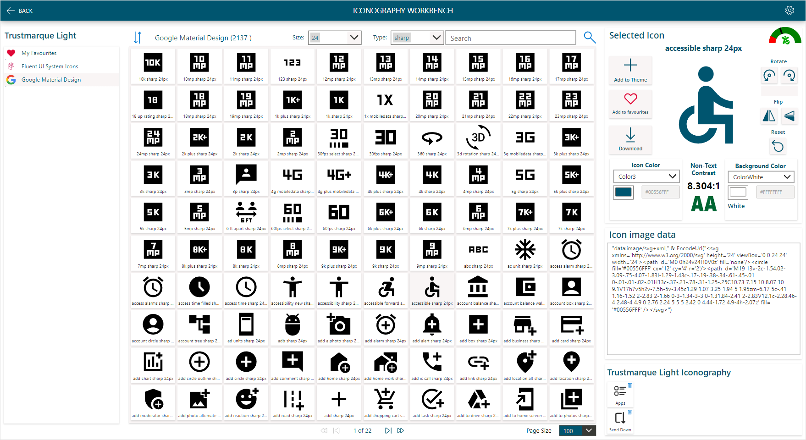
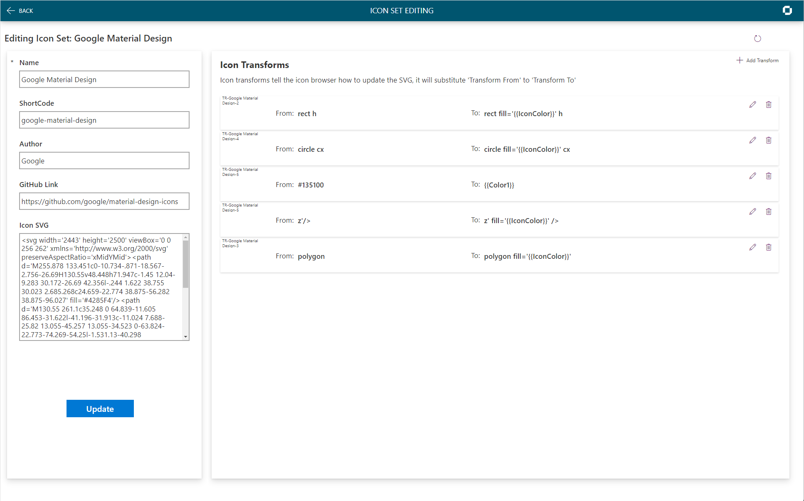
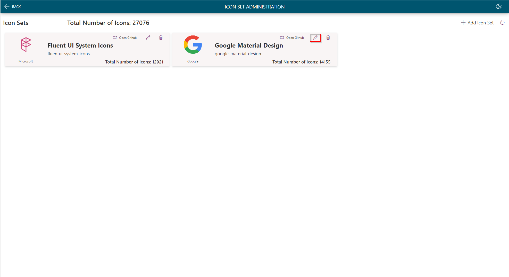
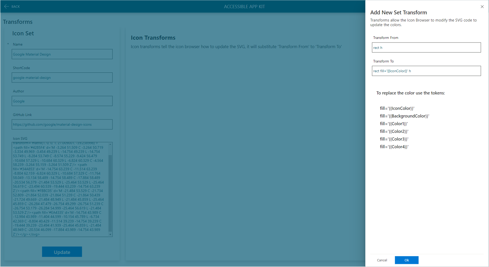
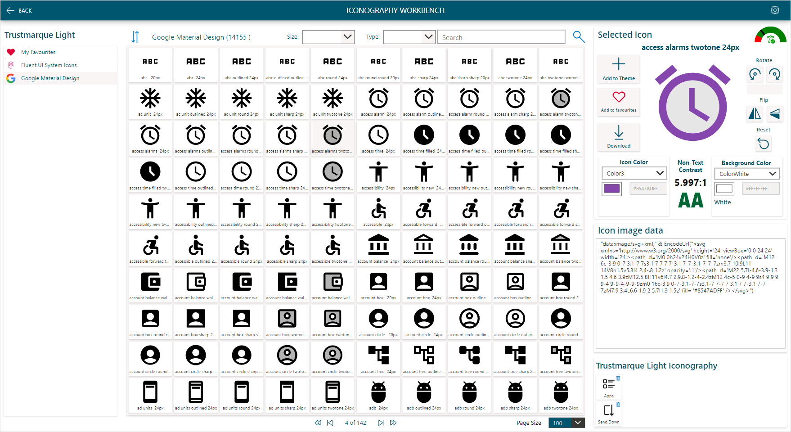

# Loading Google Material Design Icons



Open a folder where you want to download to, and use the command ```git clone https://github.com/google/material-design-icons``` (you will need Git installed.)

## Create the Icons.csv file

Once you have cloned the repository run the following Power Shell to create the **Icons.CSV** file:

```powershell
# Material Design - 
# Create CSV for Import from GitHub Repo
# https://github.com/google/material-design-icons

$counter = 1
$setName = "google-material-design"
$file = "H:\Trustmarque\accessible-app-kit\IconSets\material-design-icons\icons.csv"
$path = "H:\Trustmarque\accessible-app-kit\IconSets\material-design-icons\src\*.svg"


$icons = get-childitem -File $path -recurse
ForEach($icon in $icons){
    [string]$string = Get-Content $icon.FullName
    $trimmedFileName = $icon.Name.Replace("materialicons_","").Replace(".svg","").Split("_")
    $splitNumber = $trimmedFileName.Count
    $objResults = New-Object PSObject -Property @{
        tm_id = $counter;
        tm_name = $icon.Name.Replace("materialicons","").Replace("_"," ").Replace(".svg","");
        tm_icon = $string.Replace("""","'");
        tm_set = $setName.Replace("materialicons","")
        tm_description =  $trimmedFileName[$splitNumber -2].Replace("materialicons","")
        tm_size =  $trimmedFileName[$splitNumber -1].Replace("px","")
    }
    $counter++
    $objResults | Export-CSV $file -Append -NoTypeInformation -force
}

```

## Upload the Icons.csv file

Upload the ```icons.csv``` to the location you configured the Dataflow to use, overwriting the existing file.

## Create the Icon Set in the App

In the app on the home screen click the settings icon in the top right to Navigate to the 'Icon Set Admin Screen', click the ```+ New Icon Set``` button and complete the form as follows:

| Column Name | Value |
|--------|---------|
| Name   | Google Material Design|
| ShortCode | google-material-design|
| Author | Google |
| Github Link | https://github.com/google/material-design-icons |
| Icon SVG | ```<svg viewBox='0 0 24 24' width='24' height='24' xmlns='http://www.w3.org/2000/svg'>  <g transform='matrix(1, 0, 0, 1, 27.009001, -39.238998)'><path fill='#4285F4' d='M -3.264 51.509 C -3.264 50.719 -3.334 49.969 -3.454 49.239 L -14.754 49.239 L -14.754 53.749 L -8.284 53.749 C -8.574 55.229 -9.424 56.479 -10.684 57.329 L -10.684 60.329 L -6.824 60.329 C -4.564 58.239 -3.264 55.159 -3.264 51.509 Z'/> <path fill='#34A853' d='M -14.754 63.239 C -11.514 63.239 -8.804 62.159 -6.824 60.329 L -10.684 57.329 C -11.764 58.049 -13.134 58.489 -14.754 58.489 C -17.884 58.489 -20.534 56.379 -21.484 53.529 L -25.464 53.529 L -25.464 56.619 C -23.494 60.539 -19.444 63.239 -14.754 63.239 Z'/><path fill='#FBBC05' d='M -21.484 53.529 C -21.734 52.809 -21.864 52.039 -21.864 51.239 C -21.864 50.439 -21.724 49.669 -21.484 48.949 L -21.484 45.859 L -25.464 45.859 C -26.284 47.479 -26.754 49.299 -26.754 51.239 C -26.754 53.179 -26.284 54.999 -25.464 56.619 L -21.484 53.529 Z'/><path fill='#EA4335' d='M -14.754 43.989 C -12.984 43.989 -11.404 44.599 -10.154 45.789 L -6.734 42.369 C -8.804 40.429 -11.514 39.239 -14.754 39.239 C -19.444 39.239 -23.494 41.939 -25.464 45.859 L -21.484 48.949 C -20.534 46.099 -17.884 43.989 -14.754 43.989 Z'/></g></svg>``` |

Click OK, once the Icon Set is saved the Power Automate flow will trigger a refresh of the dataflow loading the icons into the Dataverse.

## Create Icon Color Transforms
To get the Iconography Workbench to color the icons, the following transforms need to be created.



To create a new transform, on the **Icon Set Administration Screen** click on Edit on the set you have just added.


On the ** Icon Set Edit Screen** click on **+ Add Transform**



Add the following transforms:

| Transfrom from | Transfrom to |
|--------|---------|
| rect h | rect fill='{{IconColor}}' h |
| circle cx | circle fill='{{IconColor}} cx' |
| #135100 | {{Color1}}|
| z'/> | z fill='{{IconColor}}' /> |
| polygon | polygon fill= '{{IconColor}}'|
| opacity='.3' |opacity='.1'|

## View transformed icons

Navigate back to the Iconography Workbench and select Google Material Design in the Icon set gallery, select an icon and the colours will be changed, when you change the color of the icon, the icon will automatically be updated.

