Accessible Apps Kit Documentation
=================================

Contents
========

* [Accessible Apps Kit](#accessible-apps-kit)
	* [StartScreen](#startscreen)
	* [OnStart](#onstart)
* [Connections](#connections)
* [Screens](#screens)
	* [Loading Screen](#loading-screen)
		* [Global variables](#global-variables)
		* ['Loading Screen' As screen](#loading-screen-as-screen)
	* [Home Screen](#home-screen)
		* [Global variables](#global-variables)
		* ['Home Screen' As screen](#home-screen-as-screen)
	* [Color Workbench Screen](#color-workbench-screen)
		* [Global variables](#global-variables)
		* ['Color Workbench Screen' As screen](#color-workbench-screen-as-screen)
		* [btnAppsKitColors As button](#btnappskitcolors-as-button)
		* [btnCreatorKitColors As button](#btncreatorkitcolors-as-button)
		* [btnBrandingTemplateColors As button](#btnbrandingtemplatecolors-as-button)
		* [frmNewThemeColor As form](#frmnewthemecolor-as-form)
		* [DataCardValue20 As text](#datacardvalue20-as-text)
		* [DataCardValue24 As text](#datacardvalue24-as-text)
		* [DataCardValue25 As text](#datacardvalue25-as-text)
		* [DataCardValue26 As text](#datacardvalue26-as-text)
		* [DataCardValue27 As text](#datacardvalue27-as-text)
		* [DataCardValue28 As text](#datacardvalue28-as-text)
		* [DataCardValue18 As text](#datacardvalue18-as-text)
		* [DataCardValue17 As text](#datacardvalue17-as-text)
	* [Font Workbench Screen](#font-workbench-screen)
		* [Global variables](#global-variables)
		* ['Font Workbench Screen' As screen](#font-workbench-screen-as-screen)
	* [Icons Workbench Screen](#icons-workbench-screen)
		* [Global variables](#global-variables)
		* ['Icons Workbench Screen' As screen](#icons-workbench-screen-as-screen)
	* [Icon Set Admin Screen](#icon-set-admin-screen)
		* [Global variables](#global-variables)
		* ['Icon Set Admin Screen' As screen](#icon-set-admin-screen-as-screen)
		* [frmIconSet As form](#frmiconset-as-form)
		* [DataCardValue9 As text](#datacardvalue9-as-text)
		* [DataCardValue10 As text](#datacardvalue10-as-text)
		* [DataCardValue11 As text](#datacardvalue11-as-text)
		* [DataCardValue12 As text](#datacardvalue12-as-text)
		* [DataCardValue5 As text](#datacardvalue5-as-text)
	* [Icon Set Transforms Screen](#icon-set-transforms-screen)
		* [Global variables](#global-variables)
		* ['Icon Set Transforms Screen' As screen](#icon-set-transforms-screen-as-screen)
		* [frmNewTransform As form](#frmnewtransform-as-form)
		* [DataCardValue21 As text](#datacardvalue21-as-text)
		* [DataCardValue22 As text](#datacardvalue22-as-text)
		* [DataCardValue19 As text](#datacardvalue19-as-text)
	* [App Themes Screen](#app-themes-screen)
		* [Global variables](#global-variables)
		* ['App Themes Screen' As screen](#app-themes-screen-as-screen)
		* [TextInput3 As text](#textinput3-as-text)
	* [Print Screen](#print-screen)
		* [Global variables](#global-variables)
		* ['Print Screen' As screen.'printableLayout_A4Portrait_ver1.0'](#print-screen-as-screenprintablelayout_a4portrait_ver10)
		* [Image11 As image](#image11-as-image)
* [Global Variables](#global-variables)
	*[Color4JSON](#ncolor4json)
	*[firstRecord](#nfirstrecord)
	*[Color3JSON](#ncolor3json)
	* [StartLoadingScreenTimer](#startloadingscreentimer)
	*[TriggerFileSelector](#ntriggerfileselector)
	*[onReset](#nonreset)
	*[iconJSON](#niconjson)
	* [LoadingText](#loadingtext)
	*[Color3LightJSON](#ncolor3lightjson)
	*[locScheme](#nlocscheme)
	*[editMenu](#neditmenu)
	*[selIcon](#nselicon)
	*[pattern](#npattern)
	*[gblChosenTheme](#ngblchosentheme)
	*[hideMenu](#nhidemenu)
	*[defaultTextColorJSON](#ndefaulttextcolorjson)
	*[iterationsNo](#niterationsno)
	* [DownloadImage](#downloadimage)
	*[Color2JSON](#ncolor2json)
	* [iconSelected](#iconselected)
	*[removeFav](#nremovefav)
	*[ThisTheme](#nthistheme)
	*[ColorBlackJSON](#ncolorblackjson)
	*[lastRecord](#nlastrecord)
	*[Color1JSON](#ncolor1json)
	*[FontSizes](#nfontsizes)
	*[addedtofav](#naddedtofav)
	*[iconSelected](#niconselected)
	*[defaultIconColor](#ndefaulticoncolor)
	*[icon_image_text](#nicon_image_text)
	*[gblChosenTheme](#ngblchosentheme)
	*[galDefault1](#ngaldefault1)
	*[locWebsiteColors](#nlocwebsitecolors)
	* [iconNow](#iconnow)
	* [gblChosenTheme](#gblchosentheme)
	*[Color1LightJSON](#ncolor1lightjson)
	*[Color2LightJSON](#ncolor2lightjson)
	*[Color5AlphaJSON](#ncolor5alphajson)
	*[ColorWhiteJSON](#ncolorwhitejson)
	*[varUser](#nvaruser)
* [DataSources](#datasources)
	* [Collections](#collections)
		*[webSafeFonts](#nwebsafefonts)
		* [allMenu](#allmenu)
		*[col_myFavouriteIcons](#ncol_myfavouriteicons)
		*[gblChosenThemeIcons](#ngblchosenthemeicons)
		*[myico](#nmyico)
		*[fontmenu](#nfontmenu)
		*[colSizes](#ncolsizes)
		*[gblChosenThemeColors](#ngblchosenthemecolors)
		*[colIconsSizes](#ncoliconssizes)
		*[gblChosenThemeColors](#ngblchosenthemecolors)
		*[fontMenu](#nfontmenu)
		* [thisIcon](#thisicon)
		*[colDesc](#ncoldesc)
		*[iterations](#niterations)
		* [colThemeColors](#colthemecolors)
		* [colIconsBackupa](#coliconsbackupa)
		*[colIcons](#ncolicons)
		*[DECtoHEX](#ndectohex)
		*[gblChosenThemeIcons](#ngblchosenthemeicons)
		*[windows11Fonts](#nwindows11fonts)
		*[powerAppsFonts](#npowerappsfonts)
		*[setTransforms](#nsettransforms)
		*[colThemeColors](#ncolthemecolors)
		*[colIcons](#ncolicons)
		*[colIcons](#ncolicons)
  
  

# Accessible Apps Kit
  

## StartScreen


```typescript
'Loading Screen'
```  
  

## OnStart


```typescript
Set(
    AppTheme,
    { palette: { themePrimary: "#00556f", themeLighterAlt: "#030709", themeLighter: "#0a1d25", themeLight: "#133645", themeTertiary: "#276c8a", themeSecondary: "#399eca", themeDarkAlt: "#52bbe8", themeDark: "#6bc5ec", themeDarker: "#90d4f1", neutralLighterAlt: "#00546d", neutralLighter: "#00526b", neutralLight: "#004f67", neutralQuaternaryAlt: "#004a60", neutralQuaternary: "#00465c", neutralTertiaryAlt: "#004358", neutralTertiary: "#c8c8c8", neutralSecondary: "#d0d0d0", neutralPrimaryAlt: "#dadada", neutralPrimary: "#fff", neutralDark: "#f4f4f4", black: "#f8f8f8", white: "#ffffff"}}
);
/*Set(
    AppThemeJson,
    JSON(
        AppTheme,
        JSONFormat.IndentFour
    )
);
*/
Set(varTheme, 
    { palette: 
        { 
            themePrimary: "#00556f", 
            themeLighterAlt: "#030709", 
            themeLighter: "#0a1d25", 
            themeLight: "#133645", 
            themeTertiary: "#276c8a", 
            themeSecondary: "#399eca", 
            themeDarkAlt: "#52bbe8", 
            themeDark: "#6bc5ec", 
            themeDarker: "#90d4f1", 
            neutralLighterAlt: "#00546d", 
            neutralLighter: "#00526b", 
            neutralLight: "#004f67", 
            neutralQuaternaryAlt: "#004a60", 
            neutralQuaternary: "#00465c", 
            neutralTertiaryAlt: "#004358", 
            neutralTertiary: "#c8c8c8", 
            neutralSecondary: "#d0d0d0", 
            neutralPrimaryAlt: "#dadada", 
            neutralPrimary: "#fff", 
            neutralDark: "#f4f4f4", 
            black: "#f8f8f8", 
            white: "#00556f"},
  paletteCSS: {
    themePrimary: "#0078d4",
    themeLighterAlt: "#eff6fc",
    themeLighter: "#deecf9",
    themeLight: "#c7e0f4",
    themeTertiary: "#71afe5",
    themeSecondary: "#2b88d8",
    themeDarkAlt: "#106ebe",
    themeDark: "#005a9e",
    themeDarker: "#004578",
    neutralLighterAlt: "#faf9f8",
    neutralLighter: "#f3f2f1",
    neutralLight: "#edebe9",
    neutralQuaternaryAlt: "#e1dfdd",
    neutralQuaternary: "#d0d0d0",
    neutralTertiaryAlt: "#c8c6c4",
    neutralTertiary: "#a19f9d",
    neutralSecondary: "#605e5c",
    neutralPrimaryAlt: "#3b3a39",
    neutralPrimary:"#323130",
    neutralDark: "#201f1e",
    black: "#000000",
    white: "#ffffff"
  }
});

Set(
    ThisTheme,
    {
        Name:                               "Trustmarque",

        Color1:                             ColorValue("#00556f"),
        Color2:                             RGBA(56,57,53,1),
        Color3:                             RGBA(  133,  71, 173, 1),
        Color1Light:                        ColorValue("#cdcdccff"),
        Color2Light:                        RGBA(249, 245, 245, 1),
        Color3Light:                        RGBA(255,255,255,1),
        Color4:                             RGBA(  188,  15, 94, 1),
        Color5Alpha:                        RGBA(  0,  85, 111, 0.44),
        ColorWhite:                         RGBA(255,255,255,1),
        ColorBlack:                         RGBA(8,8,8,1),
        defaultTextColor:                   RGBA( 8,  8,  8, 1),
        defaultPadding: 5,
        defaultRadius: 10,
        defaultBorderThickness: 1,
        defaultFocusedBorderThickness: 2,
        Font: 'Segoe UI',
        HeaderFont: 'Segoe UI',
        FontSize: 12,
        DarkMode: false
    } 
);

Set(ThisThemeBackup, ThisTheme);

Set(
    FontSizes,
    {
        TextMain:                           ThisTheme.FontSize -1,
        TextEmphasis:                       ThisTheme.FontSize +1,
        Content:                            ThisTheme.FontSize +2,
        Title:                              ThisTheme.FontSize +6,
        SubTitle:                           ThisTheme.FontSize +4,
        AddPicture:                         ThisTheme.FontSize -3,
        XtraSmall:                          ThisTheme.FontSize -5
    }
);

////////////////////////////////////////////////
//                                            //
// -- Set Control-level default Properties -- //
//                                            //
////////////////////////////////////////////////

Set(
    ControlsTheme,
    {

        LabelTextColor:                     ThisTheme.defaultTextColor,
        LabelFill:                          Transparent,
        LabelBorderColor:                   ThisTheme.Color2,
        LabelFont:                          ThisTheme.Font,

        ButtonColor:                        ThisTheme.Color2Light,
        ButtonFill:                         ThisTheme.Color2,
        ButtonBorderColor:                  ThisTheme.Color1,
        ButtonHoverColor:                   ColorFade(ThisTheme.Color2Light, 20%),
        ButtonHoverFill:                    ColorFade(ThisTheme.Color2,     20%),
        ButtonHoverBorderColor:             ColorFade(ThisTheme.Color1,     20%),
        ButtonPressedColor:                 ThisTheme.Color2,
        ButtonPressedFill:                  ThisTheme.Color2Light,
        ButtonPressedBorderColor:           ThisTheme.Color2,
        ButtonFont:                         ThisTheme.Font,

        InputTextColor:                     ThisTheme.Color1,
        InputFill:                          ThisTheme.ColorWhite,
        InputBorderColor:                   ThisTheme.Color2,
        InputHoverColor:                    ColorFade(ThisTheme.Color1, 20%),
        InputHoverFill:                     ColorFade(ThisTheme.Color1Light, 20%),
        InputHoverBorderColor:              ColorFade(ThisTheme.Color2Light, 20%),
        InputPressedColor:                  ThisTheme.Color1Light,
        InputPressedFill:                   ThisTheme.Color1,
        InputPressedBorderColor:            ColorFade(ThisTheme.Color2, 20%),
        InputFont:                          ThisTheme.Font,
        InputDelayOutput:                   true,

        PenInputInkColor:                   ThisTheme.defaultTextColor,
        PenInputBorderColor:                ThisTheme.defaultTextColor,
        PenInputInkSize:                    2,
        PenInputBackground:                 Transparent,

        DropdownTextColor:                  ThisTheme.Color1Light,
        DropdownFill:                       ThisTheme.Color1,
        DropdownBorderColor:                ThisTheme.Color2,
        DropdownHoverColor:                 ColorFade(ThisTheme.Color1Light, 20%),
        DropdownHoverFill:                  ColorFade(ThisTheme.Color1, 20%),
        DropdownHoverBorderColor:           ColorFade(ThisTheme.Color2, 20%),
        DropdownPressedColor:               ThisTheme.Color1,
        DropdownPressedFill:                ThisTheme.Color1Light,
        DropdownPressedBorderColor:         ColorFade(ThisTheme.Color2, -20%),
        DropdownChevronBackground:          ThisTheme.Color2,
        DropdownChevronFill:                ThisTheme.Color2Light,
        DropdownChevronHoverBackground:     ColorFade(ThisTheme.Color2, 20%),
        DropdownChevronHoverFill:           ColorFade(ThisTheme.Color2Light, 20%),
        DropdownSelectionColor:             ThisTheme.Color3Light,
        DropdownSelectionFill:              ThisTheme.Color3,
        DropdownFont:                       ThisTheme.Font,

        ComboBoxTextColor:                  ThisTheme.Color1,
        ComboBoxFill:                       ThisTheme.Color3Light,
        ComboBoxBorderColor:                ThisTheme.Color2,
        ComboBoxHoverColor:                 ColorFade(ThisTheme.Color1, 20%),
        ComboBoxHoverFill:                  ColorFade(ThisTheme.Color1Light, 20%),
        ComboBoxHoverBorderColor:           ColorFade(ThisTheme.Color2Light, 20%),
        ComboBoxPressedColor:               ThisTheme.Color2,
        ComboBoxPressedFill:                ThisTheme.Color2Light,
        ComboBoxPressedBorderColor:         ColorFade(ThisTheme.Color2Light, -20%),
        ComboBoxSelectionColor:             ThisTheme.Color3Light,
        ComboBoxSelectionFill:              ThisTheme.Color3,
        ComboBoxChevronBackground:          ThisTheme.Color2Light,
        ComboBoxChevronFill:                ThisTheme.Color2,
        ComboBoxChevronHoverBackground:     ColorFade(ThisTheme.Color2, 20%),
        ComboBoxChevronHoverFill:           ColorFade(ThisTheme.Color2Light, 20%),
        ComboBoxFont:                       ThisTheme.Font,
        ComboBoxMoreItemsButtonColor:       ThisTheme.Color2,
        
        DatePickerColor:                    ThisTheme.Color1Light,
        DatePickerFill:                     ThisTheme.Color1,
        DatePickerBorderColor:              ThisTheme.Color2,
        DatePickerIconFill:                 ThisTheme.Color2Light,
        DatePickerIconBackground:           ThisTheme.Color2,
        DatePickerSelectedDateFill:         ThisTheme.Color2,
        DatePickerHoverDateFill:            ThisTheme.Color3Light,
        DatePickerHeaderFill:               ThisTheme.Color3,
        DatePickerFont:                     ThisTheme.Font,
        //
        // Sancho's note:
        // Tried to template these but IDE import only picks up design properties currently :(
        //
        // DatePickerStartOfWeek:          StartOfWeek.Monday,
        // DatePickerFormat:               DateTimeFormat.ShortDate,
        // DatePickerDefaultDate:          Today(),
        // DatePickerDateTimeZone:         DateTimeZone.Local,
        // DatePickerLanguage:             "en-GB",


        ListBoxTextColor:                   ThisTheme.Color1Light,
        ListBoxFill:                        ThisTheme.Color1,
        ListBoxBorderColor:                 ThisTheme.Color2,
        ListBoxHoverColor:                  ColorFade(ThisTheme.Color1Light, 20%),
        ListBoxHoverFill:                   ColorFade(ThisTheme.Color1, 20%),
        ListBoxHoverBorderColor:            ColorFade(ThisTheme.Color2, 20%),
        ListBoxPressedColor:                ThisTheme.Color2Light,
        ListBoxPressedFill:                 ThisTheme.Color2,
        ListBoxPressedBorderColor:          ColorFade(ThisTheme.Color2, -20%),       
        ListBoxSelectionColor:              ThisTheme.Color3Light,
        ListBoxSelectionFill:               ThisTheme.Color3,
        ListBoxFont:                        ThisTheme.Font,
        ListBoxItemPaddingLeft:             10,

        CheckBoxTextColor:                  ThisTheme.defaultTextColor,
        CheckBoxInnerBackground:            If(
                                                ThisTheme.DarkMode,
                                                ColorFade(ThisTheme.Color1, -50%),
                                                ColorFade(ThisTheme.Color1, 50%)
                                            ),
        CheckBoxBorderColor:                ThisTheme.Color2,
        CheckBoxHoverColor:                 ColorFade(ThisTheme.defaultTextColor, 20%),
        CheckBoxHoverFill:                  ColorFade(Transparent, 20%),
        CheckBoxHoverBorderColor:           ColorFade(ThisTheme.Color2, 20%),
        CheckBoxPressedColor:               ColorFade(ThisTheme.defaultTextColor, -20%),
        CheckBoxPressedFill:                ColorFade(Transparent, -20%),
        CheckBoxPressedBorderColor:         ColorFade(ThisTheme.Color2, -20%),
        CheckBoxOutsideBorderColor:         ThisTheme.Color2,
        CheckBoxFill:                       Transparent,
        CheckBoxCheckmarkFill:              ThisTheme.defaultTextColor,
        CheckBoxFont:                       ThisTheme.Font,
        CheckBoxSize:                       40,
        
        RadioTextColor:                     ThisTheme.defaultTextColor,
        RadioOutsideFill:                   Transparent,
        RadioOutsideBorderColor:            ThisTheme.Color2,
        RadioHoverColor:                    ThisTheme.Color2,
        RadioHoverFill:                     Transparent,
        RadioPressedColor:                  ThisTheme.defaultTextColor,
        RadioPressedFill:                   Transparent,
        RadioBorderColor:                   ThisTheme.Color2,
        RadioBackgroundFill:                If(ThisTheme.DarkMode,
                                                ColorFade(ThisTheme.Color1, -50%),
                                                ColorFade(ThisTheme.Color1, 50%)
                                            ),
        RadioSelectionFill:                 ThisTheme.defaultTextColor,
        RadioFont:                          ThisTheme.Font,
        RadioSize:                          40,
        RadioLayout:                        Layout.Horizontal,
        
        ToggleTextColor:                    ThisTheme.defaultTextColor,
        ToggleBorderColor:                  ThisTheme.Color2,
        ToggleHandleFill:                   ThisTheme.Color2,
        ToggleFalseFill:                    ThisTheme.Color1,
        ToggleTrueFill:                     ThisTheme.Color3,
        ToggleFalseHoverFill:               ColorFade(ThisTheme.Color1, 20%),
        ToggleTrueHoverFill:                ColorFade(ThisTheme.Color3, 20%),
        ToggleHoverBorderColor:             ColorFade(ThisTheme.Color2, 20%),
        TogglePressedBorderColor:           ColorFade(ThisTheme.Color2, -20%),
        ToggleFont:                         ThisTheme.Font,
        ToggleTextPosition:                 TextPosition.Left,

        SliderBorderColor:                  ThisTheme.Color2,
        SliderHandleFill:                   White,
        SliderBackground:                   ThisTheme.Color3,
        SliderValueFill:                    ThisTheme.Color2,
        SliderHandleHoverFill:              ColorFade(White, 20%),
        SliderHandleActiveFill:             ColorFade(White, 40%),
        SliderRailHoverFill:                ColorFade(ThisTheme.Color3,  20%),
        SliderValueHoverFill:               ColorFade(ThisTheme.Color2,  20%),
        SliderHoverBorderColor:             ColorFade(ThisTheme.Color2,  20%),
        SliderPressedBorderColor:           ColorFade(ThisTheme.Color2, -20%),
        SliderRailThickness:                24,
        SliderHandleSize:                   24,

        RatingItemFill:                     ThisTheme.Color2,
        RatingFill:                         Transparent,
        RatingBorderColor:                  ThisTheme.Color2,

        TimerTextColor:                     ThisTheme.Color1Light,
        TimerFill:                          ThisTheme.Color1,
        TimerBorderColor:                   ColorFade(ThisTheme.Color1, -20%),
        TimerHoverColor:                    ColorFade(ThisTheme.Color1Light, 20%),
        TimerHoverFill:                     ColorFade(ThisTheme.Color1,  20%),
        TimerHoverBorderColor:              ColorFade(ThisTheme.Color1,  20%),
        TimerPressedColor:                  ThisTheme.Color1,
        TimerPressedFill:                   ThisTheme.Color1Light,
        TimerPressedBorderColor:            ThisTheme.Color1,
        TimerFont:                          ThisTheme.Font,
        
        ImageFill:                          Transparent,
        ImageBorderColor:                   Transparent,
        ImageHoverFill:                     Transparent,
        ImageHoverBorderColor:              Transparent,
        ImagePressedFill:                   Transparent,
        ImagePressedBorderColor:            Transparent,

        CameraBorderColor:                  ThisTheme.Color2,

        BarcodeColor:                       ThisTheme.Color1Light,
        BarcodeFill:                        ThisTheme.Color1,
        BarcodeBorderColor:                 ThisTheme.Color2,
        BarcodeHoverColor:                  ColorFade(ThisTheme.Color1Light, 20%),
        BarcodeHoverFill:                   ColorFade(ThisTheme.Color1, 20%),
        BarcodeHoverBorderColor:            ColorFade(ThisTheme.Color2, 20%),
        BarcodePressedColor:                ThisTheme.Color1,
        BarcodePressedFill:                 ThisTheme.Color1Light,
        BarcodePressedBorderColor:          ThisTheme.Color1,
        BarcodeFont:                        ThisTheme.Font,
        
        VideoFill:                          ThisTheme.Color1,
        VideoBorderColor:                   ThisTheme.Color2,

        StreamColor:                        ThisTheme.defaultTextColor,
        StreamFill:                         Transparent,
        StreamBorderColor:                  ThisTheme.Color2,

        AudioFill:                          ThisTheme.Color1,
        AudioBorderColor:                   ColorFade(ThisTheme.Color1, -20%),

        MicrophoneColor:                    ThisTheme.Color1Light,
        MicrophoneFill:                     ThisTheme.Color1,
        MicrophoneBorderColor:              ColorFade(ThisTheme.Color1, -20%),
        MicrophoneHoverColor:               ColorFade(ThisTheme.Color1Light, 20%),
        MicrophoneHoverFill:                ColorFade(ThisTheme.Color1, 20%),
        MicrophoneHoverBorderColor:         ThisTheme.Color1,
        MicrophonePressedColor:             ColorFade(ThisTheme.Color1Light, -20%),
        MicrophonePressedFill:              ColorFade(ThisTheme.Color1, -20%),
        MicrophonePressedBorderColor:       ColorFade(ThisTheme.Color1, -40%),

        AddPictureColor:                    ThisTheme.Color1Light,
        AddPictureFill:                     ThisTheme.Color1,
        AddPictureBorderColor:              ThisTheme.Color2,
        AddPictureHoverColor:               ThisTheme.Color1Light,
        AddPictureHoverFill:                ColorFade(ThisTheme.Color1, 20%),
        AddPictureHoverBorderColor:         ColorFade(ThisTheme.Color2, 20%),
        AddPicturePressedColor:             ThisTheme.Color1Light,
        AddPicturePressedFill:              ColorFade(ThisTheme.Color1, -20%),
        AddPicturePressedBorderColor:       ColorFade(ThisTheme.Color2, -20%),
        AddPictureFont:                     ThisTheme.Font,

        ImportColor:                        ThisTheme.Color1Light,
        ImportFill:                         ThisTheme.Color1,
        ImportBorderColor:                  ColorFade(ThisTheme.Color1, -20%),
        ImportFont:                         ThisTheme.Font,
        ImportHoverColor:                   ColorFade(ThisTheme.Color1Light, 20%),
        ImportHoverFill:                    ColorFade(ThisTheme.Color1, 20%),
        ImportHoverBorderColor:             ThisTheme.Color1,
        ImportPressedColor:                 ThisTheme.Color1Light,
        ImportPressedFill:                  ColorFade(ThisTheme.Color1, -20%),
        ImportPressedBorderColor:           ColorFade(ThisTheme.Color1, -40%),

        ExportColor:                        ThisTheme.Color1Light,
        ExportFill:                         ThisTheme.Color1,
        ExportBorderColor:                  ColorFade(ThisTheme.Color1, -20%),
        ExportFont:                         ThisTheme.Font,
        ExportHoverColor:                   ColorFade(ThisTheme.Color1Light, 20%),
        ExportHoverFill:                    ColorFade(ThisTheme.Color1, 20%),
        ExportHoverBorderColor:             ThisTheme.Color1,
        ExportPressedColor:                 ThisTheme.Color1Light,
        ExportPressedFill:                  ColorFade(ThisTheme.Color1, -20%),
        ExportPressedBorderColor:           ColorFade(ThisTheme.Color1, -40%),

        ChartLegendColor:                   ThisTheme.defaultTextColor,
        ChartLegendFont:                    ThisTheme.Font,

        /////////////////
        //
        // Gallery Items
        //
        GalleryFill:                        RGBA(0,0,0,0),
        GalleryBorderColor:                 ThisTheme.Color2,
        //
        // Gallery Title and Subtitle
        //
        GallerytitleLabelColor:             ThisTheme.Color3,
        GallerysubtitleLabelColor:          ThisTheme.defaultTextColor,
        GallerytitleLabelFont:              ThisTheme.Font,
        GallerysubtitleLabelFont:           ThisTheme.Font,
        //
        // Body content label in Flexible Height Gallery
        //
        GallerycontentLabelColor:           ThisTheme.defaultTextColor,
        GallerycontentLabelFont:            ThisTheme.Font,
        //
        /////////////////

        /////////////////
        //
        // Icons
        //
        // This will apply to all icons
        // (excluding new screen icons used as BGs)
        //
        // IconFill is also used for the background shape of
        // the New Screen headers in: List
        //
        IconFill:                           ThisTheme.Color3,
        IconHoverFill:                      ThisTheme.Color3Light,
        IconPressedFill:                    ThisTheme.Color1,
        // Background set to transparent by default to preserve New Screen-based icons
        IconBackground:                     Transparent,
        IconHoverBackground:                Transparent,
        IconPressedBackground:              Transparent,
        IconBorderColor:                    ColorFade(ThisTheme.Color3, -20%),
        IconHoverBorderColor:               ThisTheme.Color3,
        IconPressedBorderColor:             ColorFade(ThisTheme.Color3, -40%),
        

        AttachmentTextColor:                ThisTheme.Color1Light,
        AttachmentFill:                     ThisTheme.Color1,
        AttachmentBorderColor:              ThisTheme.Color2,
        AttachmentHoverColor:               ColorFade(ThisTheme.Color1Light, 20%),
        AttachmentHoverFill:                ColorFade(ThisTheme.Color1, 20%),
        AttachmentHoverBorderColor:         ColorFade(ThisTheme.Color2, 20%),
        AttachmentFont:                     ThisTheme.Font,
        AttachmentPressedColor:             ThisTheme.Color2Light,
        AttachmentPressedFill:              ThisTheme.Color2,
        AttachmentItemColor:                ThisTheme.Color3Light,
        AttachmentItemFill:                 ThisTheme.Color3,
        AttachmentItemHoverColor:           ColorFade(ThisTheme.Color3Light, 20%),
        AttachmentItemHoverFill:            ColorFade(ThisTheme.Color3, 20%),

        /////////////////
        //
        // Forms
        //
        EditFormBorderColor:                ThisTheme.Color2,
        EditFormFill:                       If( 
                                                ThisTheme.DarkMode,
                                                ThisTheme.ColorBlack,
                                                ThisTheme.ColorWhite
                                            ),
        ViewFormBorderColor:                ThisTheme.Color2,
        ViewFormFill:                       If(
                                               ThisTheme.DarkMode,
                                                ThisTheme.ColorBlack,
                                                ThisTheme.ColorWhite
                                            ),
        // Form Title and * fields
        FormTitleLabelColor:                ThisTheme.ColorBlack,
        FormTitleLabelFont:                 ThisTheme.Font,

        /////////////////
        //
        // Screen
        //
        ScreenBackground:                 White /*If( 
                                                ThisTheme.DarkMode,
                                                ColorFade(ThisTheme.Color1, -50%),
                                                ColorFade(ThisTheme.Color1, 50%)
                                            )*/,

        /////////////////
        //
        // Data Table
        //
        //
        // NotUsed
           DataTableColor1:                    ThisTheme.Color1,
           DataTableColor2:                    ThisTheme.Color2,
        // Border Lines between headers
        DataTableColor3:                    ThisTheme.Color3,
        //
        DataTableColor:                     ThisTheme.Color1Light,
        DataTableFill:                      ThisTheme.Color1,
        DataTableColorInverted:             ThisTheme.Color3Light,
        DataTableSelectedColor:             ThisTheme.Color3Light,
        DataTableSelectedFill:              ThisTheme.Color3,
        DataTableHoverColor:                ThisTheme.Color2Light,
        DataTableHoverFill:                 ThisTheme.Color2,
        DataTableBorderColor:               ThisTheme.Color2,
        DataTableInputFill:                 ThisTheme.Color1,
        DataTableFont:                      ThisTheme.Font,
        DataTableHeadingFont:               ThisTheme.Font,
        DataTableHeadingColor:              ThisTheme.Color2Light,
        DataTableHeadingFill:               ThisTheme.Color2,
        DataTableFontWeight:                FontWeight.Normal,
        DataTableHeadingFontWeight:         FontWeight.Semibold,

        /////////////////
        //
        // PDFViewer & PowerBI
        //
        PdfViewerFill:                      ColorFade(ThisTheme.Color1, -50%),
        PdfViewerBorderColor:               ThisTheme.Color2,
        PowerBIBorderColor:                 ThisTheme.Color2,
        
        //////////////////////////////////////////////////
        //                                              //
        //  These apply to the Insert>New Screen items  //
        //                                              //
        //////////////////////////////////////////////////
        //
        // Title Label on New Screen Headers
        //
        invertedBkgHeaderLabelColor:        ThisTheme.Color2Light,
        //
        // New Screen Header background shape for:
        // Scrollable, Email, People, Meeting,
        // 
        // also selected tab shape colour on Meeting screen
        // see: IconFill also used for other new screen header shapes
        //
        IconFillInverted:                   ThisTheme.Color2,
        //
        // Label on Success Screen, Tutorial Screen
        // To / Subject / Message Title on Email screen
        // SubTitle label on PeopleBrowseGallery on Email Screen
        // Attendees/Subject/Message labels on Meeting screen
        // No Times/Locations labels on Schedule tab of Meeting Screen
        // All Left-side labels, and right-side time labels on Calendar screen
        // ALSO:
        // SubHeader Text Colour on Calendar Screen - NB this is same as BG colour
        // SubHeader Text Colour on Schedule tab of Meeting screen - NB this is same as BG colour
        //
        basicNoSizeLabelColor:              ThisTheme.Color3,
        //
        // Tick on Success Screen
        // Send Icon Color on Email Screen
        //
        invertedBkgHeaderIconColor:         ThisTheme.Color3Light,
        //
        // Title label and icon color in PeopleGallery on Email Screen, People Screen and Meeting Screen
        //
        basicNoSizeInvertedBkgLabelColor:   ThisTheme.Color3Light,
        //
        // Invite & Schedule tab header label on Meeting screen
        // Rooms list name label on Schedule tab on Meeting Screen
        //
        basicNoSizeWeightColorLabelColor:   ThisTheme.defaultTextColor
    }
);
Set(ControlsThemeBackup, ControlsTheme);

/////////////////////////////////////////////
//                                         //
// -- Set Control-level Font properties -- //
//                                         //
//    This is separated from the above     //
//  to enable easy changing of font size   //
//                                         //
/////////////////////////////////////////////
Set(
    ControlsFontSizes,
    {
        LabelFontSize:                      FontSizes.TextMain,
        ButtonFontSize:                     FontSizes.TextEmphasis,
        InputFontSize:                      FontSizes.TextMain,
        DropdownFontSize:                   FontSizes.TextMain,
        ComboBoxFontSize:                   FontSizes.TextMain,
        DatePickerFontSize:                 FontSizes.TextMain,
        ListBoxFontSize:                    FontSizes.TextMain,
        CheckBoxFontSize:                   FontSizes.TextMain,
        RadioFontSize:                      FontSizes.TextMain,
        ToggleFontSize:                     FontSizes.TextMain,
        TimerFontSize:                      FontSizes.Title,
        BarcodeFontSize:                    FontSizes.TextEmphasis,
        AddPictureFontSize:                 FontSizes.AddPicture,
        ImportFontSize:                     FontSizes.TextEmphasis,
        ExportFontSize:                     FontSizes.TextEmphasis,
        ChartLegendFontSize:                FontSizes.AddPicture,
        GallerytitleLabelFontSize:          FontSizes.Title,
        GallerysubtitleLabelFontSize:       FontSizes.SubTitle,
        GallerycontentLabelFontSize:        FontSizes.Content,
        AttachmentFontSize:                 FontSizes.TextMain,
        FormTitleLabelFontSize:             FontSizes.TextMain,
        DataTableFontSize:                  FontSizes.TextMain,
        DataTableHeadingFontSize:           FontSizes.TextEmphasis
    }
);

Set(TempControlsFontSizes, ControlsFontSizes);


/////////////////////////////////////
//                                 //
// -- Set default Chart Colours -- //
//                                 //
////////////////////////////////////////////////////////////
//                                                        //
//     You can extend these past the initial 10 here,     //
//           the colours should loop through.             //
//                                                        //
////////////////////////////////////////////////////////////
Set(
    ReservedChartColorSet,
    [
        RGBA( 49, 130,  93,   1),
        RGBA( 48, 166, 103,   1),
        RGBA( 94, 193, 108,   1),
        RGBA(246, 199, 144,   1),
        RGBA(247, 199, 114,   1),
        RGBA(247, 180,  91,   1),
        RGBA(246, 143, 100,   1),
        RGBA(212,  96, 104,   1),
        RGBA(148, 110, 176,   1),
        RGBA(118, 154, 204,   1)
    ]
);


    ////////////////////////////////////////////////////////////////////////////////////////////////
    //                                                                                            //
    //  -- These are the collections of Themes --                                                 //
    //  --         insert your own here        --                                                 //
    //  --      or remove them altogether      --                                                 //
    //                                                                                            //
    //  You may feel that there is no need to have a change of themes, however please             //
    //  remember that there are people out there who are colorblind or have other visual          //
    //  conditions. I implore you to please keep at least your own theme plus the two             //
    //  highly-contrasted monochrome themes for accessibility reasons. You can also take the      //
    //  code from the 'accessibility eye' on the header These monochrome themes have a high       //
    //  contrast ratio and are easily visible.                                                    //
    //                                                                                            //
    //  These have been separated from the concurrent above as they rely on the variables in it.  //
    //                                                                                            //
    ////////////////////////////////////////////////////////////////////////////////////////////////

ClearCollect(BrandingColours,
    {
        Name:                               "PensPlace Dark",

        Color1:                             RGBA(8,8, 8, 1),
        Color2:                             RGBA( 42,  47, 50, 1),
        Color3:                             RGBA(  224,  8, 55, 1),
        Color1Light:                         RGBA( 255,  255,  255, 1),
        Color2Light:                         RGBA(245, 245, 245, 1),
        Color3Light:                         RGBA(111,147,255,1),

        defaultTextColor:                   RGBA( 248,  248,  248, 1),
        
        Font:                               Font.'Segoe UI',
        FontSize:                           14,

        DarkMode:                           true
    } ,
    {
        Name:                               "Microsoft Blue Light",
        Color1:                             RGBA(186, 202, 226, 1),
        Color2:                             RGBA( 56,  96, 178, 1),
        Color3:                             RGBA(  0,  18, 107, 1),
        Color1Light:                         RGBA( 15,  15,  15, 1),
        Color2Light:                         RGBA(245, 245, 245, 1),
        Color3Light:                         RGBA(245, 245, 245, 1),

        defaultTextColor:                   RGBA( 15,  15,  15, 1),
        
        Font:                               Font.'Segoe UI',
        FontSize:                           14,

        DarkMode:                           false
    },
    {
        ///////////////////////////////////////////////////////////////////////
        //
        // This is an example of how to:
        // Override the individual control-level properties in a theme
        //
        // Add your override property to the theme and then set it - that's it!
        // (Property must be one of the properties in the ControlsTheme record)
        //
        // The theme will use its default colours
        // unless specified as an override here
        //
        // You can safely delete this.
        //
        ///////////////////////////////////////////////////////////////////////
        Name:                               "Garish Control-level Test",
        Color1:                             RGBA(186, 202, 226, 1),
        Color2:                             RGBA( 56,  96, 178, 1),
        Color3:                             RGBA(  0,  18, 107, 1),
        Color1Light:                         RGBA( 15,  15,  15, 1),
        Color2Light:                         RGBA(245, 245, 245, 1),
        Color3Light:                         RGBA(245, 245, 245, 1),

        defaultTextColor:                   RGBA( 15,  15,  15, 1),
        
        Font:                               Font.'Segoe UI',
        FontSize:                           14,

        DarkMode:                           false,

        LabelTextColor:                     Green,
        LabelFont:                          Font.'Great Vibes',
        ButtonFill:                         Red,
        DropdownTextColor:                  Red,
        DropdownFill:                       LightGray,
        DropdownBorderColor:                Purple,
        DropdownChevronBackground:          Orange,
        PenInputBackground:                 Pink,
        DataTableHeadingFont:               Font.'Dancing Script',
        DataTableHeadingColor:              Black,
        DataTableHeadingFill:               RGBA(0,255,0,25%),
        DataTableSelectedColor:             RGBA(255,255,255,50%),
        DataTableSelectedFill:              MediumPurple,
        GallerytitleLabelColor:             Red,
        GallerysubtitleLabelColor:          Orange,
        GallerytitleLabelFont:              Font.'Great Vibes',
        SliderHandleFill:                   Cyan,
        SliderBackground:                   Red,
        SliderValueFill:                    Fuchsia,
        FormTitleLabelColor:                Chartreuse,
        EditFormFill:                       RGBA(209, 130, 255, 1),
        DatePickerColor:                    Chartreuse,
        DatePickerFill:                     DarkGreen,
        DatePickerIconFill:                 White,
        DatePickerIconBackground:           Red,
        DatePickerSelectedDateFill:         DarkOrange,
        DatePickerHoverDateFill:            LightCoral,
        DatePickerHeaderFill:               Fuchsia,
        DatePickerFont:                     Font.'Great Vibes',
        IconFill:                           Fuchsia,
        InputFill:                          Fuchsia,
        PenInputInkColor:                   Magenta,
        PenInputInkSize:                    5
    },
    {
        Name:                               "Microsoft Blue Dark",
        Color1:                             RGBA(  0,  18, 107, 1),
        Color2:                             RGBA(56,   96, 178, 1),
        Color3:                             RGBA(186, 202, 226, 1),
        Color1Light:                         RGBA(245, 245, 245, 1),
        Color2Light:                         RGBA(245, 245, 245, 1),
        Color3Light:                         RGBA( 15,  15,  15, 1),

        defaultTextColor:                   RGBA(245, 245, 245, 1),
        
        Font:                               Font.'Segoe UI',
        FontSize:                           14,

        DarkMode:                           true
    },
    {
        Name:                               "MonoChrome Light",
        Color1:                             RGBA(190, 190, 190, 1),
        Color2:                             RGBA(130, 130, 130, 1),
        Color3:                             RGBA( 90,  90,  90, 1),
        Color1Light:                         RGBA( 15,  15,  15, 1),
        Color2Light:                         RGBA(245, 245, 245, 1),
        Color3Light:                         RGBA(245, 245, 245, 1),

        defaultTextColor:                   RGBA( 15,  15,  15, 1),
        
        Font:                               Font.'Segoe UI',
        FontSize:                           14,

        DarkMode:                           false
    },
    {
        Name:                               "MonoChrome Dark",
        Color1:                             RGBA( 90,  90,  90, 1),
        Color2:                             RGBA(130, 130, 130, 1),
        Color3:                             RGBA(190, 190, 190, 1),
        Color1Light:                         RGBA(245, 245, 245, 1),
        Color2Light:                         RGBA(245, 245, 245, 1),
        Color3Light:                         RGBA( 15,  15,  15, 1),

        defaultTextColor:                   RGBA(245, 245, 245, 1),
        
        Font:                               Font.'Segoe UI',
        FontSize:                           14,

        DarkMode:                           true
    }

    /////////////////////// Your Theme(s) Here?  ///////////////////////
    //
    //////////////////  You can add your own themes  ///////////////////
    ///////  by copying the lines below and uncommenting them  /////////
    ///  you can add any of the properties listed in ControlsTheme  ////
    //
    //,{
    //    Name:                                "Totally Awesome Theme 9000",
    //    Color1:                              RGBA( 90,  90,  90, 1),
    //    Color2:                              RGBA(130, 130, 130, 1),
    //    Color3:                              RGBA(190, 190, 190, 1),
    //    Color1Light:                          RGBA(245, 245, 245, 1),
    //    Color2Light:                          RGBA(245, 245, 245, 1),
    //    Color3Light:                          RGBA( 15,  15,  15, 1),
    //    defaultTextColor:                    RGBA(245, 245, 245, 1),
    //    Font:                                Font.'Segoe UI',
    //    FontSize:                            14,
    //    DarkMode:                            true
    //}

    ////////////////////////////////////////////////////////////////////
    //
    // You can remove my "iAm_ManCat Purples Dark" theme below,
    // but not the "Control-level Override" theme.
    //
    ,
    {
        Name:                               "iAm_ManCat Purples Dark",
        Color1:                             RGBA(120,   0, 190, 1),
        Color2:                             RGBA(160,   0, 255, 1),
        Color3:                             RGBA(209, 130, 255, 1),
        Color1Light:                         RGBA(255, 255, 255, 1),
        Color2Light:                         RGBA(255, 255, 255, 1),
        Color3Light:                         RGBA( 15,  15,  15, 1),

        defaultTextColor:                   RGBA(245, 245, 245, 1),
        
        Font:                               Font.'Segoe UI',
        FontSize:                           14,

        DarkMode:                           true
    },

//////////////////////////////////////////////////////////////////////////
//
// This is hidden from the list of themes and is there to allow the logic
//   for the control-level individual overrides for each theme to work
//
//                DO NOT REMOVE this record from the list
//    if you are planning on using multiple themes and my theme screen.
//
//////////////////////////////////////////////////////////////////////////
    {
        Name:                           "Control-level Override",
        Color1: Red, Color2: Red, Color3: Red, Color1Light: Red, Color2Light: Red, Color3Light: Red, defaultTextColor: Red, Font: Font.'Segoe UI', FontSize: 14, DarkMode: false, LabelTextColor: Red, LabelFill: Red, LabelBorderColor: Red, LabelFont: Font.'Segoe UI', ButtonColor: Red, ButtonFill: Red, ButtonBorderColor: Red, ButtonHoverColor: Red, ButtonHoverFill: Red, ButtonHoverBorderColor: Red, ButtonPressedColor: Red, ButtonPressedFill: Red, ButtonPressedBorderColor: Red, ButtonFont: Font.'Segoe UI', InputTextColor: Red, InputFill: Red, InputBorderColor: Red, InputHoverColor: Red, InputHoverFill: Red, InputHoverBorderColor: Red, InputPressedColor: Red, InputPressedFill: Red, InputPressedBorderColor: Red, InputFont: Font.'Segoe UI', InputDelayOutput: true, PenInputInkColor: Red, PenInputBorderColor: Red, PenInputInkSize: 2, PenInputBackground: Red, DropdownTextColor: Red, DropdownFill: Red, DropdownBorderColor: Red, DropdownHoverColor: Red, DropdownHoverFill: Red, DropdownHoverBorderColor: Red, DropdownPressedColor: Red, DropdownPressedFill: Red, DropdownPressedBorderColor: Red, DropdownChevronBackground: Red, DropdownChevronFill: Red, DropdownChevronHoverBackground: Red, DropdownChevronHoverFill: Red, DropdownSelectionColor: Red, DropdownSelectionFill: Red, DropdownFont: Font.'Segoe UI', ComboBoxTextColor: Red, ComboBoxFill: Red, ComboBoxBorderColor: Red, ComboBoxHoverColor: Red, ComboBoxHoverFill: Red, ComboBoxHoverBorderColor: Red, ComboBoxPressedColor: Red, ComboBoxPressedFill: Red, ComboBoxPressedBorderColor: Red, ComboBoxSelectionColor: Red, ComboBoxSelectionFill: Red, ComboBoxChevronBackground: Red, ComboBoxChevronFill: Red, ComboBoxChevronHoverBackground: Red, ComboBoxChevronHoverFill: Red, ComboBoxFont: Font.'Segoe UI', ComboBoxMoreItemsButtonColor: Red, DatePickerColor: Red, DatePickerFill: Red, DatePickerBorderColor: Red, DatePickerIconFill: Red, DatePickerIconBackground: Red, DatePickerSelectedDateFill: Red, DatePickerHoverDateFill: Red, DatePickerHeaderFill: Red, DatePickerFont: Font.'Segoe UI', ListBoxTextColor: Red, ListBoxFill: Red, ListBoxBorderColor: Red, ListBoxHoverColor: Red, ListBoxHoverFill: Red, ListBoxHoverBorderColor: Red, ListBoxPressedColor: Red, ListBoxPressedFill: Red, ListBoxPressedBorderColor: Red, 
 ListBoxSelectionColor: Red, ListBoxSelectionFill: Red, ListBoxFont: Font.'Segoe UI', ListBoxItemPaddingLeft: 10, CheckBoxTextColor: Red, CheckBoxInnerBackground: Red, CheckBoxBorderColor: Red, CheckBoxHoverColor: Red, CheckBoxHoverFill: Red, CheckBoxHoverBorderColor: Red, CheckBoxPressedColor: Red, CheckBoxPressedFill: Red, CheckBoxPressedBorderColor: Red, CheckBoxOutsideBorderColor: Red, CheckBoxFill: Red, CheckBoxCheckmarkFill: Red, CheckBoxFont: Font.'Segoe UI', CheckBoxSize: 40, RadioTextColor: Red, RadioOutsideFill: Red, RadioOutsideBorderColor: Red, RadioHoverColor: Red, RadioHoverFill: Red, RadioPressedColor: Red, RadioPressedFill: Red, RadioBorderColor: Red, RadioBackgroundFill: Red, RadioSelectionFill: Red, RadioFont: Font.'Segoe UI', RadioSize: 40, RadioLayout: Layout.Horizontal, ToggleTextColor: Red, ToggleBorderColor: Red, ToggleHandleFill: Red, ToggleFalseFill: Red, ToggleTrueFill: Red, ToggleFalseHoverFill: Red, ToggleTrueHoverFill: Red, ToggleHoverBorderColor: Red, TogglePressedBorderColor: Red, ToggleFont: Font.'Segoe UI', ToggleTextPosition: TextPosition.Left, SliderBorderColor: Red, SliderHandleFill: Red, SliderBackground: Red, SliderValueFill: Red, SliderHandleHoverFill: Red, SliderHandleActiveFill: Red, SliderRailHoverFill: Red, SliderValueHoverFill: Red, SliderHoverBorderColor: Red, SliderPressedBorderColor: Red, SliderRailThickness: 24, SliderHandleSize: 24, RatingItemFill: Red, RatingFill: Red, RatingBorderColor: Red, TimerTextColor: Red, TimerFill: Red, TimerBorderColor: Red, TimerHoverColor: Red, TimerHoverFill: Red, TimerHoverBorderColor: Red, TimerPressedColor: Red, TimerPressedFill: Red, TimerPressedBorderColor: Red, TimerFont: Font.'Segoe UI', ImageFill: Red, ImageBorderColor: Red, ImageHoverFill: Red, ImageHoverBorderColor: Red, ImagePressedFill: Red, ImagePressedBorderColor: Red, CameraBorderColor: Red, BarcodeColor: Red, BarcodeFill: Red, BarcodeBorderColor: Red, BarcodeHoverColor: Red, BarcodeHoverFill: Red, BarcodeHoverBorderColor: Red, BarcodePressedColor: Red, BarcodePressedFill: Red, BarcodePressedBorderColor: Red, BarcodeFont: Font.'Segoe UI', VideoFill: Red, VideoBorderColor: Red, StreamColor: Red, StreamFill: Red, StreamBorderColor: Red, AudioFill: Red, AudioBorderColor: Red, MicrophoneColor: Red, MicrophoneFill: Red, MicrophoneBorderColor: Red, MicrophoneHoverColor: Red, MicrophoneHoverFill: Red, MicrophoneHoverBorderColor: Red, MicrophonePressedColor: Red, MicrophonePressedFill: Red, MicrophonePressedBorderColor: Red, AddPictureColor: Red, AddPictureFill: Red, AddPictureBorderColor: Red, AddPictureHoverColor: Red, AddPictureHoverFill: Red, AddPictureHoverBorderColor: Red, AddPicturePressedColor: Red, AddPicturePressedFill: Red, AddPicturePressedBorderColor: Red, AddPictureFont: Font.'Segoe UI', ImportColor: Red, ImportFill: Red, ImportBorderColor: Red, ImportFont: Font.'Segoe UI', ImportHoverColor: Red, ImportHoverFill: Red, ImportHoverBorderColor: Red, ImportPressedColor: Red, ImportPressedFill: Red, ImportPressedBorderColor: Red, ExportColor: Red, ExportFill: Red, ExportBorderColor: Red, ExportFont: Font.'Segoe UI', ExportHoverColor: Red, ExportHoverFill: Red, ExportHoverBorderColor: Red, ExportPressedColor: Red, ExportPressedFill: Red, ExportPressedBorderColor: Red, ChartLegendColor: Red, ChartLegendFont: Font.'Segoe UI', GalleryFill: Red, GalleryBorderColor: Red, GallerytitleLabelColor: Red, GallerysubtitleLabelColor: Red, GallerytitleLabelFont: Font.'Segoe UI', GallerysubtitleLabelFont: Font.'Segoe UI', GallerycontentLabelColor: Red, GallerycontentLabelFont: Font.'Segoe UI', IconFill: Red, IconHoverFill: Red, IconPressedFill: Red, IconBackground: Red, IconHoverBackground: Red, IconPressedBackground: Red, IconBorderColor: Red, IconHoverBorderColor: Red, IconPressedBorderColor: Red, AttachmentTextColor: Red, AttachmentFill: Red, AttachmentBorderColor: Red, AttachmentHoverColor: Red, AttachmentHoverFill: Red, AttachmentHoverBorderColor: Red, AttachmentFont: Font.'Segoe UI', AttachmentPressedColor: Red, AttachmentPressedFill: Red, AttachmentItemColor: Red, AttachmentItemFill: Red, AttachmentItemHoverColor: Red, AttachmentItemHoverFill: Red, EditFormBorderColor: Red, EditFormFill: Red, ViewFormBorderColor: Red, ViewFormFill: Red, FormTitleLabelColor: Red, FormTitleLabelFont: Font.'Segoe UI', ScreenBackground: Red, DataTableColor1: Red, DataTableColor2: Red, DataTableColor3: Red, DataTableColor: Red, DataTableFill: Red, DataTableColorInverted: Red, DataTableSelectedColor: Red, DataTableSelectedFill: Red, DataTableHoverColor: Red, DataTableHoverFill: Red, DataTableBorderColor: Red, DataTableInputFill: Red, DataTableFont: Font.'Segoe UI', DataTableHeadingFont: Font.'Segoe UI', DataTableHeadingColor: Red, DataTableHeadingFill: Red, DataTableFontWeight: FontWeight.Normal, DataTableHeadingFontWeight: FontWeight.Semibold, PdfViewerFill: Red, PdfViewerBorderColor: Red, PowerBIBorderColor: Red, invertedBkgHeaderLabelColor: Red, IconFillInverted: Red, basicNoSizeLabelColor: Red, invertedBkgHeaderIconColor: Red, basicNoSizeInvertedBkgLabelColor: Red, basicNoSizeWeightColorLabelColor: Red
    }
);
///////////////////////////////////
//                               //
//  End of Default theme Values  //
//                               //
///////////////////////////////////

/*

Concurrent(
    Set(ChosenThemeColor1,Mid(Color1JSON,2,9)),
    Set(ChosenThemeColor1Light,Mid(Color1LightJSON,2,9)),
    Set(ChosenThemeColor2,Mid(Color2JSON,2,9)),
    Set(ChosenThemeColor2Light,Mid(Color2LightJSON,2,9)),
    Set(ChosenThemeColor3,Mid(Color3JSON,2,9)),
    Set(ChosenThemeColor3Light,Mid(Color3LightJSON,2,9)),
    Set(ChosenThemeColor4,Mid(Color4JSON,2,9)),
    Set(ChosenThemeColor5Alpha,Mid(Color5AlphaJSON,2,9))
);

*/

///////////////////////////////////
//                               //
//  Your Code From Here onwards  //
//                               //
///////////////////////////////////


// Assign the User variable to a static value
//
//  NB! This is no longer required as User() is now cached 
//  and more performant due to recent improvements to Power Apps 
//
// Set(CurrentUser, User());


// Check if current user is the current Developer of the App
// 
// If(User().Email = "gabe.newell@steampowered.com",
//    Set(Developer, true));
//
// You could have this check against a list of email addresses
// or against membership of any group (AD/Exchange/Dataverse/SharePoint)
//
//If("pen.warner" in User().Email, Set(Developer, true));


// Set hidden Dev items to false
//
// This hides all hidden dev items such as
// buttons that trigger code or other developer-only items.
//
Set(DevHidden, false);

```
# Connections
  
**Color Names (Standard)**  
  
sku: Enterprise  
  
With following datasources:  

- ColourNames
  
  
**Colour Lovers (Standard)**  
  
sku: Enterprise  
  
With following datasources:  

- ColourLovers
  
  
**Colorfyit (Standard)**  
  
sku: Enterprise  
  
With following datasources:  

- Colorfyit
  
  
**The Color API (Standard)**  
  
sku: Enterprise  
  
With following datasources:  

- TheColorAPI
  

# Screens
  
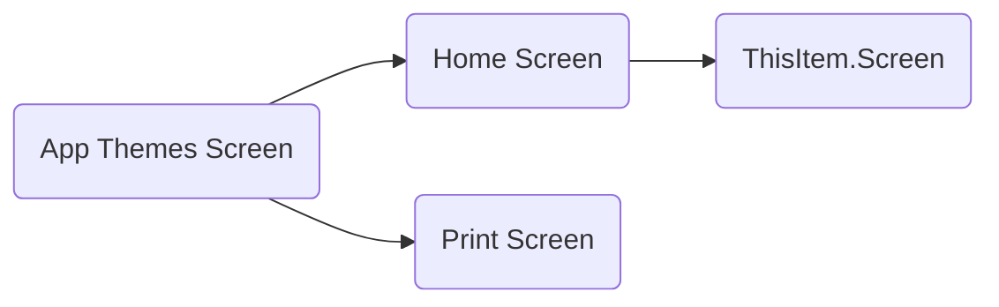
## Loading Screen
  
---
### Global variables
  
Following variables have been created / or updated on this screen
- Color4JSON
- Color3JSON
- StartLoadingScreenTimer
- TriggerFileSelector
- LoadingText
- Color3LightJSON
- editMenu
- hideMenu
- defaultTextColorJSON
- Color2JSON
- ColorBlackJSON
- Color1JSON
- defaultIconColor
- gblChosenTheme
- Color1LightJSON
- Color2LightJSON
- Color5AlphaJSON
- ColorWhiteJSON
- varUser

### 'Loading Screen' As screen

#### OnVisible


```typescript
=Set(StartLoadingScreenTimer, false); Set(StartLoadingScreenTimer, true);
Set(LoadingText, "...");
```
## Home Screen
  
---
### Global variables
  
Following variables have been created / or updated on this screen
- gblChosenTheme

### 'Home Screen' As screen

## Color Workbench Screen
  
---
### Global variables
  
Following variables have been created / or updated on this screen
- locScheme
- pattern
- locWebsiteColors

### 'Color Workbench Screen' As screen

#### OnVisible


```typescript
=UpdateContext({ ctxComponentEvent: "SetFocus" & Text(Rand()),locGenRoot: "#FFFFFFFF" });
ClearCollect(
    colThemeColors,
    AddColumns(
        Sort(
        Filter(
            'Theme Colors',
            'Theme Colors (Views)'.'Active Theme Colors',
            Theme.'App Themes' = gblChosenTheme.'App Themes'
        ),
        Name,
        Ascending
    ),"isExpanded",false)
);
Set(
        pattern,
        ColourLovers.GetNewPalettes({format: "json"})
    );
```
### btnAppsKitColors As button

#### OnSelect


```typescript
=UpdateContext({varCreatingColors: true});

Concurrent(
    
    Patch(
        'Theme Colors',
        Defaults('Theme Colors'),
        {
            Name: "Color1",
            R: 0,
            G: 85,
            B: 111,
            A: 1,
            tm_hex: "#383935FF",
            'Relative Luminance': 0.07644696,
            'Paired With Name': "Color1Light",
            Theme: gblChosenTheme
        }
    ),
    Patch(
        'Theme Colors',
        Defaults('Theme Colors'),
        {
            Name: "Color2",
            R: 56,
            G: 57,
            B: 53,
            A: 1,
            tm_hex: "#00556FFF",
            'Relative Luminance': 0.04024049,
            'Paired With Name': "Color2Light",
            Theme: gblChosenTheme
        }
    ),
    Patch(
        'Theme Colors',
        Defaults('Theme Colors'),
        {
            Name: "Color3",
            R: 133,
            G: 71,
            B: 173,
            A: 1,
            tm_hex: "#8547ADFF",
            'Relative Luminance': 0.12510152,
            'Paired With Name': "Color3Light",
            Theme: gblChosenTheme
        }
    ),
    Patch(
        'Theme Colors',
        Defaults('Theme Colors'),
        {
            Name: "Color1Light",
            R: 205,
            G: 205,
            B: 204,
            A: 1,
            tm_hex: "#CDCDCCFF",
            'Relative Luminance': 0.61001412,
            'Paired With Name': "",
            Theme: gblChosenTheme
        }
    ),
    Patch(
        'Theme Colors',
        Defaults('Theme Colors'),
        {
            Name: "Color2Light",
            R: 249,
            G: 245,
            B: 245,
            A: 1,
            tm_hex: "#F9F5F5FF",
            'Relative Luminance': 0.92037125,
            'Paired With Name': "",
            Theme: gblChosenTheme
        }
    ),
    Patch(
        'Theme Colors',
        Defaults('Theme Colors'),
        {
            Name: "Color3Light",
            R: 255,
            G: 255,
            B: 255,
            A: 1,
            tm_hex: "#FFFFFFFF",
            'Relative Luminance': 1,
            'Paired With Name': "",
            Theme: gblChosenTheme
        }
    ),
    Patch(
        'Theme Colors',
        Defaults('Theme Colors'),
        {
            Name: "Color4",
            R: 255,
            G: 255,
            B: 255,
            A: 1,
            tm_hex: "#FFFFFFFF",
            'Relative Luminance': 1,
            'Paired With Name': "",
            Theme: gblChosenTheme
        }
    ),
    Patch(
        'Theme Colors',
        Defaults('Theme Colors'),
        {
            Name: "Color5Alpha",
            R: 0,
            G: 85,
            B: 111,
            A: .30,
            tm_hex: "#00556F4C",
            'Relative Luminance': 0.07644696,
            'Paired With Name': "",
            Theme: gblChosenTheme
        }
    ),
    Patch(
        'Theme Colors',
        Defaults('Theme Colors'),
        {
            Name: "ColorWhite",
            R: 255,
            G: 255,
            B: 255,
            A: 1,
            tm_hex: "#FFFFFFFF",
            'Relative Luminance': 1,
            'Paired With Name': "",
            Theme: gblChosenTheme
        }
    ),
    Patch(
        'Theme Colors',
        Defaults('Theme Colors'),
        {
            Name: "ColorBlack",
            R: 8,
            G: 8,
            B: 8,
            A: 1,
            tm_hex: "#080808FF",
            'Relative Luminance': 0.00242822,
            'Paired With Name': "",
            Theme: gblChosenTheme
        }
    ),
    Patch(
        'Theme Colors',
        Defaults('Theme Colors'),
        {
            Name: "defaultTextColor",
            R: 8,
            G: 8,
            B: 8,
            A: 1,
            tm_hex: "#080808FF",
            'Relative Luminance': 0.00242822,
            'Paired With Name': "",
            Theme: gblChosenTheme
        }
    )
);
Clear(colThemeColors);Collect(colThemeColors,Sort(Filter('Theme Colors',Theme.'App Themes' = gblChosenTheme.'App Themes'),Name,Ascending));
```
#### Text


```typescript
="btnAppsKitColors"
```
### btnCreatorKitColors As button

#### OnSelect


```typescript
=UpdateContext({varCreatingColors: true});
/*              
            
            
            black: "#f8f8f8", 
            white: "#00556f"}
            
            With({
    R: LookUp(DECtoHEX,HEX = "00").DEC,
    G: LookUp(DECtoHEX,HEX = "55").DEC,
    B: LookUp(DECtoHEX,HEX = "6F").DEC
},*/
Concurrent(
    
    Patch(
        'Theme Colors',
        Defaults('Theme Colors'),
        {
            Name: "themePrimary",
            R: 0,
            G: 85,
            B: 111,
            A: 1,
            tm_hex: "#00556FFF",
            'Relative Luminance': 0.07644696,
            'Paired With Name': "",
            Theme: gblChosenTheme
        }
    ),
    Patch(
        'Theme Colors',
        Defaults('Theme Colors'),
        {
            Name: "themeLighterAlt",
            R: 3,
            G: 7,
            B: 9,
            A: 1,
            tm_hex: "#030709FF",
            'Relative Luminance': 0.0019104,
            'Paired With Name': "",
            Theme: gblChosenTheme
        }
    ),
    Patch(
        'Theme Colors',
        Defaults('Theme Colors'),
        {
            Name: "themeLighter",
            R: 10,
            G: 29,
            B: 37,
            A: 1,
            tm_hex: "#0A1D25FF",
            'Relative Luminance': 0.01076831,
            'Paired With Name': "",
            Theme: gblChosenTheme
        }
    ),
    //themeLight: "#133645",
    Patch(
        'Theme Colors',
        Defaults('Theme Colors'),
        {
            Name: "themeLight",
            R: 19,
            G: 54,
            B: 69,
            A: 1,
            tm_hex: "#133645FF",
            'Relative Luminance': 0.03206452,
            'Paired With Name': "",
            Theme: gblChosenTheme
        }
    ),
    //themeTertiary: "#276c8a"
    Patch(
        'Theme Colors',
        Defaults('Theme Colors'),
        {
            Name: "themeTertiary",
            R: 39,
            G: 108,
            B: 138,
            A: 1,
            tm_hex: "#F9F5F5FF",
            'Relative Luminance': 0.12991437,
            'Paired With Name': "",
            Theme: gblChosenTheme
        }
    ),
    //themeSecondary: "#399eca",  
    Patch(
        'Theme Colors',
        Defaults('Theme Colors'),
        {
            Name: "themeSecondary",
            R: 57,
            G: 158,
            B: 202,
            A: 1,
            tm_hex: "#399ECAFF",
            'Relative Luminance': 1,
            'Paired With Name': "",
            Theme: gblChosenTheme
        }
    ),
    //themeDarkAlt: "#52bbe8"
    Patch(
        'Theme Colors',
        Defaults('Theme Colors'),
        {
            Name: "themeDarkAlt",
            R: 82,
            G: 187,
            B: 232,
            A: 1,
            tm_hex: "#52BBE8FF",
            'Relative Luminance': 0.43160681,
            'Paired With Name': "",
            Theme: gblChosenTheme
        }
    ),
    //themeDark: "#6bc5ec", 
    Patch(
        'Theme Colors',
        Defaults('Theme Colors'),
        {
            Name: "themeDark",
            R: 107,
            G: 197,
            B: 236,
            A: 1,
            tm_hex: "#6BC5ECFF",
            'Relative Luminance': 0.49114433,
            'Paired With Name': "",
            Theme: gblChosenTheme
        }
    ),
    //themeDarker: "#90d4f1",
    Patch(
        'Theme Colors',
        Defaults('Theme Colors'),
        {
            Name: "themeDarker",
            R: 144,
            G: 212,
            B: 241,
            A: 1,
            tm_hex: "#90D4F1FF",
            'Relative Luminance': 0.59367133,
            'Paired With Name': "",
            Theme: gblChosenTheme
        }
    ),
    //neutralLighterAlt: "#00546d",
    Patch(
        'Theme Colors',
        Defaults('Theme Colors'),
        {
            Name: "neutralLighterAlt",
            R: 0,
            G: 84,
            B: 109,
            A: 1,
            tm_hex: "#00546DFF",
            'Relative Luminance': 0.07444774,
            'Paired With Name': "",
            Theme: gblChosenTheme
        }
    ),
    //neutralLight: "#004f67", , ,
    Patch(
        'Theme Colors',
        Defaults('Theme Colors'),
        {
            Name: "neutralLight",
            R: 0,
            G: 79,
            B: 103,
            A: 1,
            tm_hex: "#004F67FF",
            'Relative Luminance': 0.06571237,
            'Paired With Name': "",
            Theme: gblChosenTheme
        }
    ),
    //neutralQuaternaryAlt: "#004a60",
    Patch(
        'Theme Colors',
        Defaults('Theme Colors'),
        {
            Name: "neutralQuaternaryAlt",
            R: 0,
            G: 74,
            B: 96,
            A: 1,
            tm_hex: "#004A60FF",
            'Relative Luminance': 0.05742087,
            'Paired With Name': "",
            Theme: gblChosenTheme
        }
    ),
    //neutralQuaternary: "#00465c", 
    Patch(
        'Theme Colors',
        Defaults('Theme Colors'),
        {
            Name: "neutralQuaternary",
            R: 0,
            G: 70,
            B: 92,
            A: 1,
            tm_hex: "#00465CFF",
            'Relative Luminance': 0.05742087,
            'Paired With Name': "",
            Theme: gblChosenTheme
        }
    ),
    //neutralTertiaryAlt: "#004358", 
    Patch(
        'Theme Colors',
        Defaults('Theme Colors'),
        {
            Name: "neutralTertiaryAlt",
            R: 0,
            G: 67,
            B: 88,
            A: 1,
            tm_hex: "#004358FF",
            'Relative Luminance': 0.0471889,
            'Paired With Name': "",
            Theme: gblChosenTheme
        }
    ),
        // neuneutralPrimaryAlt: "#dadada",  
    Patch(
        'Theme Colors',
        Defaults('Theme Colors'),
        {
            Name: "neuneutralPrimaryAlt",
            R: 218,
            G: 218,
            B: 218,
            A: 1,
            tm_hex: "#DADADAFF",
            'Relative Luminance': 0.70110189,
            'Paired With Name': "",
            Theme: gblChosenTheme
        }
    ),
    //neutralPrimary: "#fff", 
    Patch(
        'Theme Colors',
        Defaults('Theme Colors'),
        {
            Name: "neutralPrimary",
            R: 255,
            G: 255,
            B: 255,
            A: 1,
            tm_hex: "#FFFFFFFF",
            'Relative Luminance': 1,
            'Paired With Name': "",
            Theme: gblChosenTheme
        }
    ),
    //neutralDark: "#f4f4f4", 
    Patch(
        'Theme Colors',
        Defaults('Theme Colors'),
        {
            Name: "neutralDark",
            R: 244,
            G: 244,
            B: 244,
            A: 1,
            tm_hex: "#F4F4F4FF",
            'Relative Luminance': 0.90466117,
            'Paired With Name': "",
            Theme: gblChosenTheme
        }
    ),
    // black: "#f8f8f8", 
    Patch(
        'Theme Colors',
        Defaults('Theme Colors'),
        {
            Name: "black",
            R: 244,
            G: 244,
            B: 244,
            A: 1,
            tm_hex: "#F4F4F4FF",
            'Relative Luminance': 0.90466117,
            'Paired With Name': "",
            Theme: gblChosenTheme
        }
    ),
    //        white: "#00556f"}
    Patch(
        'Theme Colors',
        Defaults('Theme Colors'),
        {
            Name: "white",
            R: 0,
            G: 86,
            B: 111,
            A: 1,
            tm_hex: "#00556FFF",
            'Relative Luminance':0.07644696,
            'Paired With Name': "",
            Theme: gblChosenTheme
        }
    )
);
Clear(colThemeColors);Collect(colThemeColors,Sort(Filter('Theme Colors',Theme.'App Themes' = gblChosenTheme.'App Themes'),Name,Ascending));
```
#### Text


```typescript
="btnAppsKitColors"
```
### btnBrandingTemplateColors As button

#### OnSelect


```typescript
=UpdateContext({varCreatingColors: true});

Concurrent(
    
    Patch(
        'Theme Colors',
        Defaults('Theme Colors'),
        {
            Name: "Color1",
            R: 120,
            G: 0,
            B: 190,
            A: 1,
            tm_hex: "#7800BEFF",
            'Relative Luminance': 0.07710775,
            'Paired With Name': "Color1Text",
            Theme: gblChosenTheme
        }
    ),
    Patch(
        'Theme Colors',
        Defaults('Theme Colors'),
        {
            Name: "Color2",
            R: 160,
            G: 0,
            B: 255,
            A: 1,
            tm_hex: "#A000FFFF",
            'Relative Luminance': 0.14693583,
            'Paired With Name': "Color2Text",
            Theme: gblChosenTheme
        }
    ),
    Patch(
        'Theme Colors',
        Defaults('Theme Colors'),
        {
            Name: "Color3",
            R: 133,
            G: 71,
            B: 173,
            A: 1,
            tm_hex: "#D182FFFF",
            'Relative Luminance': 0.36740573,
            'Paired With Name': "Color3Text",
            Theme: gblChosenTheme
        }
    ),
    Patch(
        'Theme Colors',
        Defaults('Theme Colors'),
        {
            Name: "Color1Text",
            R: 255,
            G: 255,
            B: 255,
            A: 1,
            tm_hex: "#FFFFFFF",
            'Relative Luminance': 1,
            'Paired With Name': "",
            Theme: gblChosenTheme
        }
    ),
    Patch(
        'Theme Colors',
        Defaults('Theme Colors'),
        {
            Name: "Color2Text",
            R: 255,
            G: 255,
            B: 255,
            A: 1,
            tm_hex: "#FFFFFFFF",
            'Relative Luminance': 1,
            'Paired With Name': "",
            Theme: gblChosenTheme
        }
    ),
    Patch(
        'Theme Colors',
        Defaults('Theme Colors'),
        {
            Name: "Color3Text",
            R: 15,
            G: 15,
            B: 15,
            A: 1,
            tm_hex: "#0F0F0FFF",
            'Relative Luminance': 0.00477695,
            'Paired With Name': "",
            Theme: gblChosenTheme
        }
    ),
    Patch(
        'Theme Colors',
        Defaults('Theme Colors'),
        {
            Name: "defaultTextColor",
            R: 245,
            G: 245,
            B: 245,
            A: 1,
            tm_hex: "#F5F5F5FF",
            'Relative Luminance': 0.91309865,
            'Paired With Name': "",
            Theme: gblChosenTheme
        }
    )
);
Clear(colThemeColors);Collect(colThemeColors,Sort(Filter('Theme Colors',Theme.'App Themes' = gblChosenTheme.'App Themes'),Name,Ascending));
```
#### Text


```typescript
="btnAppsKitColors"
```
### frmNewThemeColor As form

#### DataSource


```typescript
='Theme Colors'
```
#### Item


```typescript
=editColor
```
### DataCardValue20 As text

### DataCardValue24 As text

### DataCardValue25 As text

### DataCardValue26 As text

### DataCardValue27 As text

### DataCardValue28 As text

### DataCardValue18 As text

### DataCardValue17 As text

## Font Workbench Screen
  
---
### Global variables
  
Following variables have been created / or updated on this screen

### 'Font Workbench Screen' As screen

#### OnVisible


```typescript
=UpdateContext({ ctxComponentEvent: "SetFocus" & Text(Rand()) });
```
## Icons Workbench Screen
  
---
### Global variables
  
Following variables have been created / or updated on this screen
- iconSelected
- iterationsNo
- icon_image_text
- DownloadImage
- iconSelected
-     galDefault1
- iconNow
- firstRecord
- removeFav
- selIcon
- lastRecord
- onReset
- addedtofav
- iconJSON

### 'Icons Workbench Screen' As screen

#### OnVisible


```typescript
=Clear(colIcons);
ClearCollect( allMenu, 'Icon Sets');
UpdateContext({varPageNumber: 1});
ClearCollect(
    fontMenu,
    Ungroup(
        ForAll(
            Sequence(CountRows(allMenu)),
            {
                myRecord: Table(
                    Last(
                        FirstN(
                            allMenu,
                            Value
                        )
                    )
                ),
                ID: Value + 1
            }
        ),
        "myRecord"
    )
);
Patch(
    fontMenu,
    Defaults(allMenu),
    {
        ID: 1,
        tm_name: "My Favourites",
        tm_iconsvg: "<svg width='24' height='24' viewBox='0 0 24 24' xmlns='http://www.w3.org/2000/svg'><path fill='#e00837' d='M12.82 5.58L12 6.4l-.82-.82a5.37 5.37 0 10-7.6 7.6l7.89 7.9c.3.29.77.29 1.06 0l7.9-7.9a5.38 5.38 0 10-7.61-7.6z'/></svg>",
        tm_shortcode: "my-favourites"
    }
);
ClearCollect(
    myico,
    Filter(
        'My Favourite Icons',
        'My Favourite Icons (Views)'.'Active My Favourite Icons',
        'Created By'.internalemailaddress = varUser.internalemailaddress
    )
);
ForAll(
    myico,
    Collect(
        colIcons,
        {
            tm_icon:Icon.'Icon (tm_icon)',
            tm_name: Name,
            tm_set: Icon.Set
        }
    )
);
UpdateContext(
    {
        upload: false
    }
);
ClearCollect(
    gblChosenThemeColors,
    Filter(
        'Theme Colors',
        Theme.'App Themes' = gblChosenTheme.'App Themes'
    )
);
ClearCollect(
    gblChosenThemeIcons,
    Filter(
        'Theme Icons',
        Theme.'App Themes' = gblChosenTheme.'App Themes'
    ));
Select(btnSetIcon)

```
## Icon Set Admin Screen
  
---
### Global variables
  
Following variables have been created / or updated on this screen

### 'Icon Set Admin Screen' As screen

#### OnVisible


```typescript
=UpdateContext({locDeleteIconSet:false})
```
### frmIconSet As form

#### DataSource


```typescript
='Icon Sets'
```
### DataCardValue9 As text

### DataCardValue10 As text

### DataCardValue11 As text

### DataCardValue12 As text

### DataCardValue5 As text

## Icon Set Transforms Screen
  
---
### Global variables
  
Following variables have been created / or updated on this screen

### 'Icon Set Transforms Screen' As screen

#### OnVisible


```typescript
=UpdateContext({locDeleteIconSet:false})
```
### frmNewTransform As form

#### DataSource


```typescript
='Set Transforms'
```
#### Item


```typescript
=galTransforms.Selected
```
### DataCardValue21 As text

### DataCardValue22 As text

### DataCardValue19 As text

## App Themes Screen
  
---
### Global variables
  
Following variables have been created / or updated on this screen
- ThisTheme
- FontSizes
- gblChosenTheme
- gblChosenTheme

### 'App Themes Screen' As screen

#### OnVisible


```typescript
=NewForm(frmNewTheme);
ClearCollect(
    gblChosenThemeColors,
    Filter(
        'Theme Colors',
        Theme.'App Themes' = gblChosenTheme.'App Themes'
    )
);
ClearCollect(
    gblChosenThemeIcons,
    Filter(
        'Theme Icons',
        Theme.'App Themes' = gblChosenTheme.'App Themes'
    )
);
Set(
    gblChosenTheme,
    First(galAppThemes_as.AllItems)
);

```
### TextInput3 As text

## Print Screen
  
---
### Global variables
  
Following variables have been created / or updated on this screen

### 'Print Screen' As screen.'printableLayout_A4Portrait_ver1.0'

### Image11 As image

#### Image


```typescript
="data:image/svg+xml," & EncodeUrl(ThisItem.tm_icon)
```
#### OnSelect


```typescript
=Select(Parent)
```
# Global Variables
  
Usage of global variables is shown based on the screen(s) where this variable is set and the screen(s) where it is used. 
## Color4JSON
  

## firstRecord
  
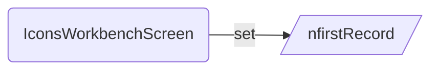
## Color3JSON
  
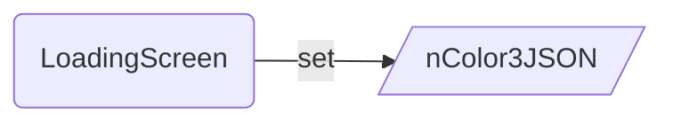
## StartLoadingScreenTimer
  
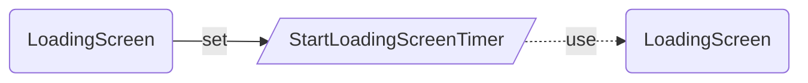
## TriggerFileSelector
  
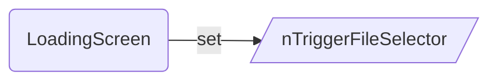
## onReset
  
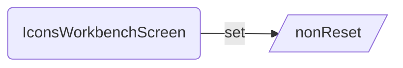
## iconJSON
  
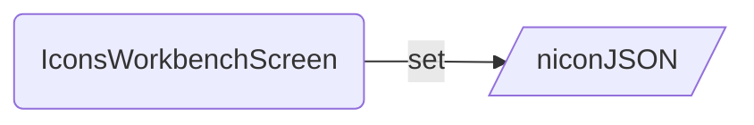
## LoadingText
  
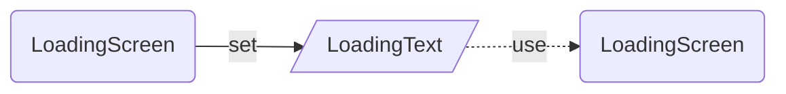
## Color3LightJSON
  
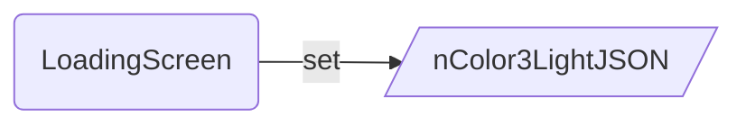
## locScheme
  
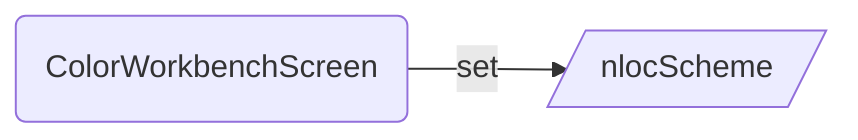
## editMenu
  
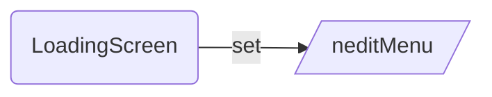
## selIcon
  
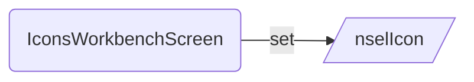
## pattern
  
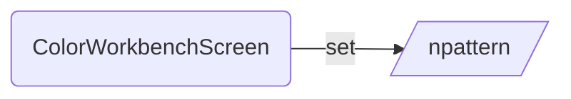
## gblChosenTheme
  
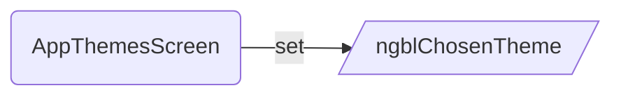
## hideMenu
  
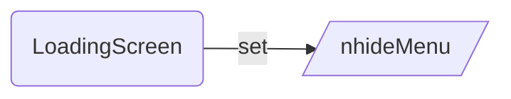
## defaultTextColorJSON
  
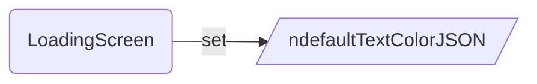
## iterationsNo
  
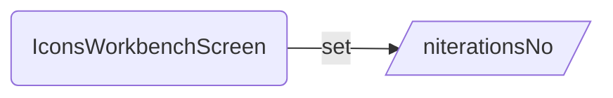
## DownloadImage
  
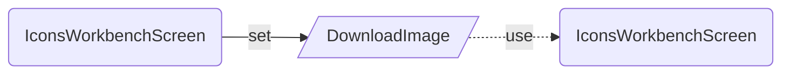
## Color2JSON
  

## iconSelected
  
```mermaid  
graph LR  
SetIconsWorkbenchScreen(IconsWorkbenchScreen)-- set -->iconSelected[/iconSelected/]  
iconSelected[/iconSelected/]-. use .->UseIconsWorkbenchScreen(IconsWorkbenchScreen)  
```
## removeFav
  
```mermaid  
graph LR  
SetIconsWorkbenchScreen(IconsWorkbenchScreen)-- set --> removeFav[/nremoveFav/]  
```
## ThisTheme
  
```mermaid  
graph LR  
SetAppThemesScreen(AppThemesScreen)-- set --> ThisTheme[/nThisTheme/]  
```
## ColorBlackJSON
  
```mermaid  
graph LR  
SetLoadingScreen(LoadingScreen)-- set --> ColorBlackJSON[/nColorBlackJSON/]  
```
## lastRecord
  
```mermaid  
graph LR  
SetIconsWorkbenchScreen(IconsWorkbenchScreen)-- set --> lastRecord[/nlastRecord/]  
```
## Color1JSON
  
```mermaid  
graph LR  
SetLoadingScreen(LoadingScreen)-- set --> Color1JSON[/nColor1JSON/]  
```
## FontSizes
  
```mermaid  
graph LR  
SetAppThemesScreen(AppThemesScreen)-- set --> FontSizes[/nFontSizes/]  
```
## addedtofav
  
```mermaid  
graph LR  
SetIconsWorkbenchScreen(IconsWorkbenchScreen)-- set --> addedtofav[/naddedtofav/]  
```
## iconSelected
  
```mermaid  
graph LR  
SetIconsWorkbenchScreen(IconsWorkbenchScreen)-- set --> iconSelected[/niconSelected/]  
```
## defaultIconColor
  
```mermaid  
graph LR  
SetLoadingScreen(LoadingScreen)-- set --> defaultIconColor[/ndefaultIconColor/]  
```
## icon_image_text
  
```mermaid  
graph LR  
SetIconsWorkbenchScreen(IconsWorkbenchScreen)-- set --> icon_image_text[/nicon_image_text/]  
```
## gblChosenTheme
  
```mermaid  
graph LR  
SetAppThemesScreen(AppThemesScreen)-- set --> gblChosenTheme[/ngblChosenTheme/]  
```
## galDefault1
  
```mermaid  
graph LR  
SetIconsWorkbenchScreen(IconsWorkbenchScreen)-- set --> galDefault1[/ngalDefault1/]  
```
## locWebsiteColors
  
```mermaid  
graph LR  
SetColorWorkbenchScreen(ColorWorkbenchScreen)-- set --> locWebsiteColors[/nlocWebsiteColors/]  
```
## iconNow
  
```mermaid  
graph LR  
SetIconsWorkbenchScreen(IconsWorkbenchScreen)-- set -->iconNow[/iconNow/]  
iconNow[/iconNow/]-. use .->UseIconsWorkbenchScreen(IconsWorkbenchScreen)  
```
## gblChosenTheme
  
```mermaid  
graph LR  
SetLoadingScreen(LoadingScreen)-- set -->gblChosenTheme[/gblChosenTheme/]  
SetHomeScreen(HomeScreen)-- set -->gblChosenTheme[/gblChosenTheme/]  
gblChosenTheme[/gblChosenTheme/]-. use .->UseHomeScreen(HomeScreen)  
gblChosenTheme[/gblChosenTheme/]-. use .->UseColorWorkbenchScreen(ColorWorkbenchScreen)  
gblChosenTheme[/gblChosenTheme/]-. use .->UseFontWorkbenchScreen(FontWorkbenchScreen)  
gblChosenTheme[/gblChosenTheme/]-. use .->UseIconsWorkbenchScreen(IconsWorkbenchScreen)  
gblChosenTheme[/gblChosenTheme/]-. use .->UseAppThemesScreen(AppThemesScreen)  
gblChosenTheme[/gblChosenTheme/]-. use .->UsePrintScreen(PrintScreen)  
```
## Color1LightJSON
  
```mermaid  
graph LR  
SetLoadingScreen(LoadingScreen)-- set --> Color1LightJSON[/nColor1LightJSON/]  
```
## Color2LightJSON
  
```mermaid  
graph LR  
SetLoadingScreen(LoadingScreen)-- set --> Color2LightJSON[/nColor2LightJSON/]  
```
## Color5AlphaJSON
  
```mermaid  
graph LR  
SetLoadingScreen(LoadingScreen)-- set --> Color5AlphaJSON[/nColor5AlphaJSON/]  
```
## ColorWhiteJSON
  
```mermaid  
graph LR  
SetLoadingScreen(LoadingScreen)-- set --> ColorWhiteJSON[/nColorWhiteJSON/]  
```
## varUser
  
```mermaid  
graph LR  
SetLoadingScreen(LoadingScreen)-- set --> varUser[/nvarUser/]  
```
# DataSources
  
---
|Name|Type|SetName|
| :--- | :--- | :--- |
|AAD Users|NativeCDSDataSourceInfo|aadusers|
|App Themes|NativeCDSDataSourceInfo|tm_appthemeses|
|Icon Sets|NativeCDSDataSourceInfo|tm_iconsets|
|Icons|NativeCDSDataSourceInfo|tm_icons|
|My Favourite Icons|NativeCDSDataSourceInfo|tm_myfavouriteicons|
|Set Transforms|NativeCDSDataSourceInfo|tm_settransformses|
|Theme Colors|NativeCDSDataSourceInfo|tm_themecolors|
|Theme Icons|NativeCDSDataSourceInfo|tm_themeicons|
|Users|NativeCDSDataSourceInfo|systemusers|

## Collections
  
Usage of Collections is shown based on the screen(s) where this collection is created and the screen(s) where it is used. 
### webSafeFonts
  
```mermaid  
graph LR  
CreateLoadingScreen(LoadingScreen)-- create --> webSafeFonts[/nwebSafeFonts/]  
```
### allMenu
  
```mermaid  
graph LR  
CreateIconsWorkbenchScreen(IconsWorkbenchScreen)-- create -->allMenu[/allMenu/]  
allMenu[/allMenu/]-. use .->UseIconsWorkbenchScreen(IconsWorkbenchScreen)  
```
### col_myFavouriteIcons
  
```mermaid  
graph LR  
CreateIconsWorkbenchScreen(IconsWorkbenchScreen)-- create --> col_myFavouriteIcons[/ncol_myFavouriteIcons/]  
```
### gblChosenThemeIcons
  
```mermaid  
graph LR  
CreateAppThemesScreen(AppThemesScreen)-- create --> gblChosenThemeIcons[/ngblChosenThemeIcons/]  
```
### myico
  
```mermaid  
graph LR  
CreateIconsWorkbenchScreen(IconsWorkbenchScreen)-- create --> myico[/nmyico/]  
```
### fontmenu
  
```mermaid  
graph LR  
CreateIconsWorkbenchScreen(IconsWorkbenchScreen)-- create --> fontmenu[/nfontmenu/]  
```
### colSizes
  
```mermaid  
graph LR  
CreateIconsWorkbenchScreen(IconsWorkbenchScreen)-- create --> colSizes[/ncolSizes/]  
```
### gblChosenThemeColors
  
```mermaid  
graph LR  
CreateIconsWorkbenchScreen(IconsWorkbenchScreen)-- create --> gblChosenThemeColors[/ngblChosenThemeColors/]  
CreateAppThemesScreen(AppThemesScreen)-- create --> gblChosenThemeColors[/ngblChosenThemeColors/]  
```
### colIconsSizes
  
```mermaid  
graph LR  
CreateIconsWorkbenchScreen(IconsWorkbenchScreen)-- create --> colIconsSizes[/ncolIconsSizes/]  
```
### gblChosenThemeColors
  
```mermaid  
graph LR  
CreateAppThemesScreen(AppThemesScreen)-- create --> gblChosenThemeColors[/ngblChosenThemeColors/]  
```
### fontMenu
  
```mermaid  
graph LR  
CreateIconsWorkbenchScreen(IconsWorkbenchScreen)-- create --> fontMenu[/nfontMenu/]  
```
### thisIcon
  
```mermaid  
graph LR  
CreateIconsWorkbenchScreen(IconsWorkbenchScreen)-- create -->thisIcon[/thisIcon/]  
thisIcon[/thisIcon/]-. use .->UseIconsWorkbenchScreen(IconsWorkbenchScreen)  
```
### colDesc
  
```mermaid  
graph LR  
CreateIconsWorkbenchScreen(IconsWorkbenchScreen)-- create --> colDesc[/ncolDesc/]  
```
### iterations
  
```mermaid  
graph LR  
CreateIconsWorkbenchScreen(IconsWorkbenchScreen)-- create --> iterations[/niterations/]  
```
### colThemeColors
  
```mermaid  
graph LR  
CreateColorWorkbenchScreen(ColorWorkbenchScreen)-- create -->colThemeColors[/colThemeColors/]  
colThemeColors[/colThemeColors/]-. use .->UseColorWorkbenchScreen(ColorWorkbenchScreen)  
```
### colIconsBackupa
  
```mermaid  
graph LR  
CreateIconsWorkbenchScreen(IconsWorkbenchScreen)-- create -->colIconsBackupa[/colIconsBackupa/]  
colIconsBackupa[/colIconsBackupa/]-. use .->UseIconsWorkbenchScreen(IconsWorkbenchScreen)  
```
### colIcons
  
```mermaid  
graph LR  
CreateIconsWorkbenchScreen(IconsWorkbenchScreen)-- create --> colIcons[/ncolIcons/]  
```
### DECtoHEX
  
```mermaid  
graph LR  
CreateLoadingScreen(LoadingScreen)-- create --> DECtoHEX[/nDECtoHEX/]  
```
### gblChosenThemeIcons
  
```mermaid  
graph LR  
CreateIconsWorkbenchScreen(IconsWorkbenchScreen)-- create --> gblChosenThemeIcons[/ngblChosenThemeIcons/]  
CreateAppThemesScreen(AppThemesScreen)-- create --> gblChosenThemeIcons[/ngblChosenThemeIcons/]  
```
### windows11Fonts
  
```mermaid  
graph LR  
CreateLoadingScreen(LoadingScreen)-- create --> windows11Fonts[/nwindows11Fonts/]  
```
### powerAppsFonts
  
```mermaid  
graph LR  
CreateLoadingScreen(LoadingScreen)-- create --> powerAppsFonts[/npowerAppsFonts/]  
```
### setTransforms
  
```mermaid  
graph LR  
CreateIconsWorkbenchScreen(IconsWorkbenchScreen)-- create --> setTransforms[/nsetTransforms/]  
```
### colThemeColors
  
```mermaid  
graph LR  
CreateColorWorkbenchScreen(ColorWorkbenchScreen)-- create --> colThemeColors[/ncolThemeColors/]  
```
### colIcons
  
```mermaid  
graph LR  
CreateIconsWorkbenchScreen(IconsWorkbenchScreen)-- create --> colIcons[/ncolIcons/]  
```
### colIcons
  
```mermaid  
graph LR  
CreateIconsWorkbenchScreen(IconsWorkbenchScreen)-- create --> colIcons[/ncolIcons/]  
```