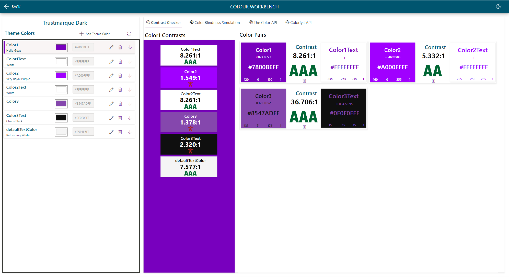

# Color Contrast Checker

Selecting the Contrast Checker tab will show the following showing the contrast betweeen the chosen color in the gallery and all other colors in the theme.

## Color Pairs

Color pairs can be configured by editing a color, only one color needs to be configured to show in the color pairs.

