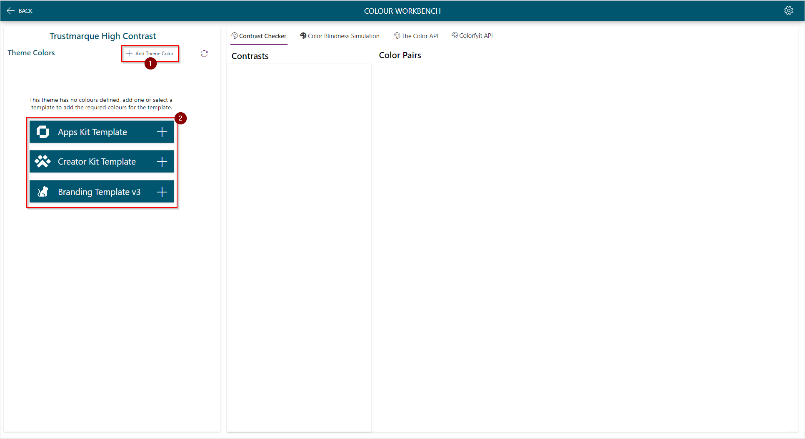
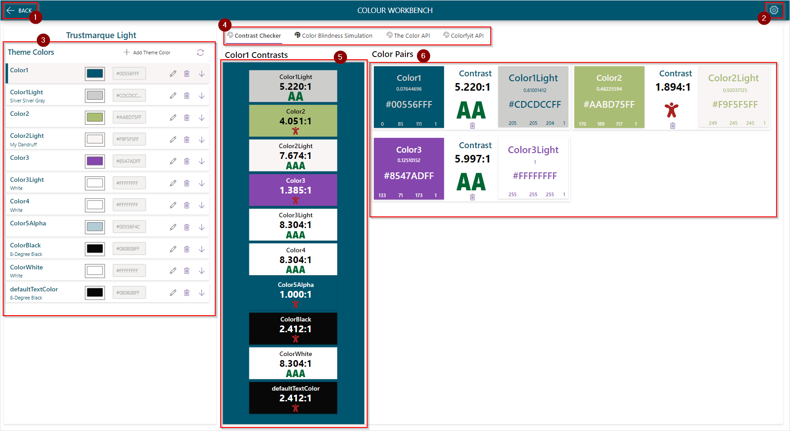
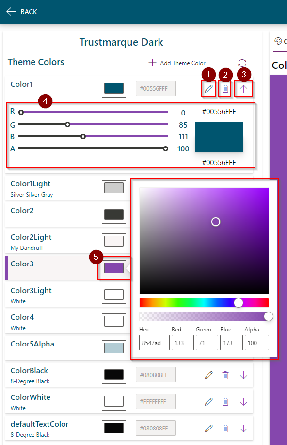
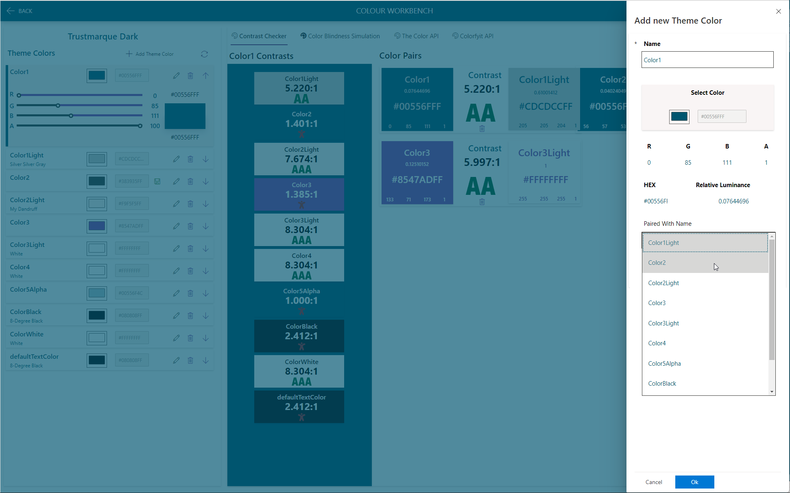
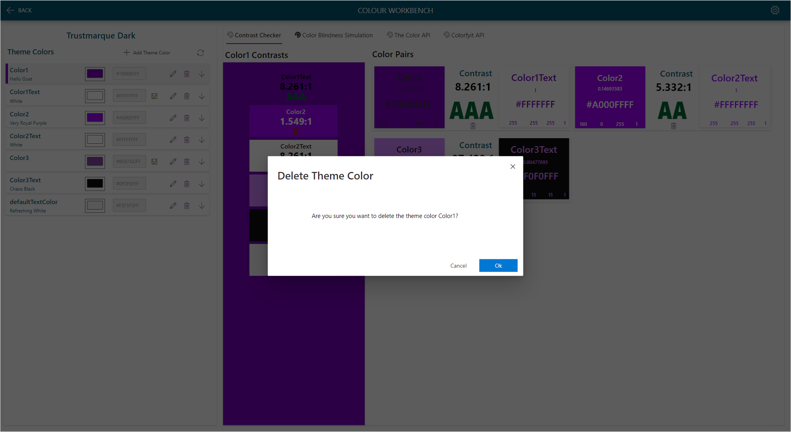
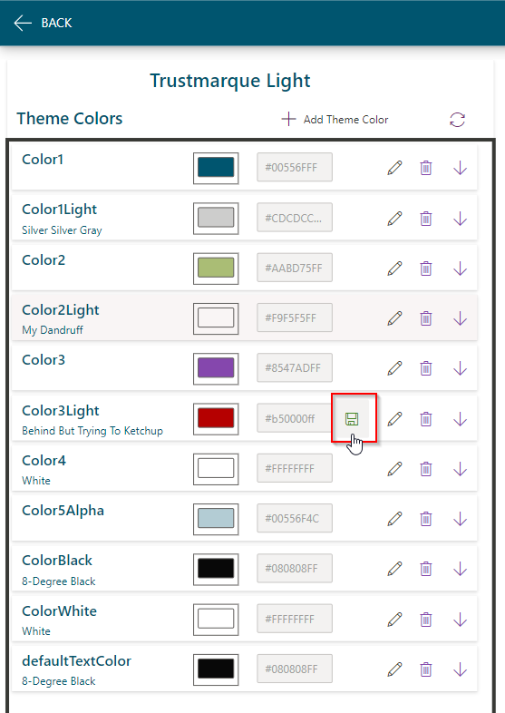

# Color Workbench

The Colour Workbench is accessed from the Home Screen once a Theme has been loaded. When first loading a theme there will be no colours in the theme, you can create a single color by clicking on '1' or create colors for a template, The Apps Kit, Creator Kit and the Branding Template v3 are supported, click on the + icon to create the required colors for the theme.

## Screen Overview

1. Back Icon
Navigate Back.
2. Settings Icon
Navigate to the Icon Set Administration Screen

3. Theme Colors Gallery

4. Colour Workbench tabs

    1. [Contrast Checker](./color-contrast-checker)
    1. [Colour Blindness Simulation](./color-blindness-simulation)
    1. [The Color API](./color-api)
    1. [Colorfyit API](./colorfyit-tab)

## Theme Colors Gallery

1. Edit Color

Clicking on the edit icon will open the Edit Color panel, on this panel you can pair the color with another in the theme which will show on the Contrast Checker Tab.

2. Delete Color

This will open the delete color dialog, confirm to delete the color from the theme.

3. Open / Close Color Sliders 

4. Extended Color Sliders

5. Color Picker

## Save an Edited colour

When editing a colour the Save icon will appear, click the icon to save the editied color to the theme.

