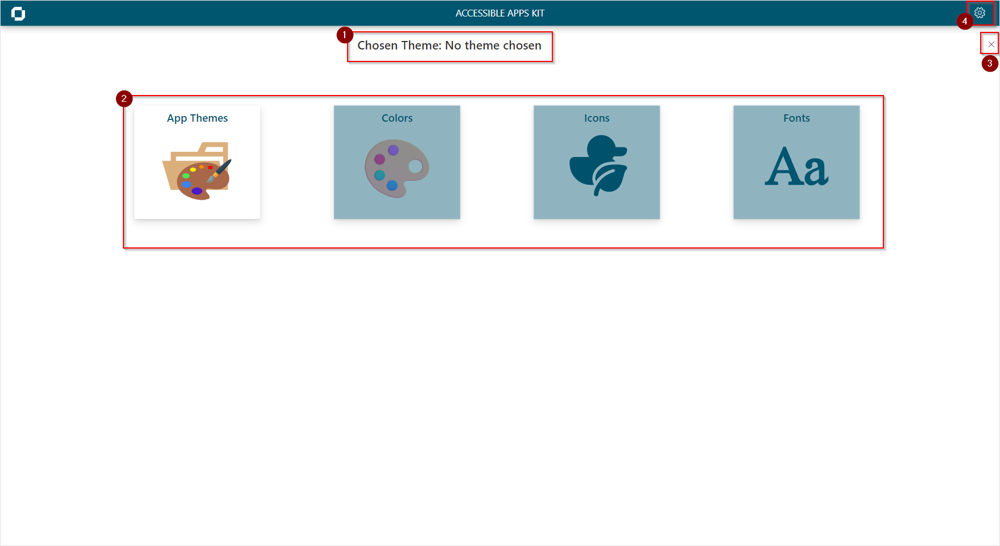

When first loading the App you will be presented with the home screen:

1. Heading shows the theme that is loaded.
2. Main Menu
3. Clear the chosen theme.
4. Navigate to the Icon Set Administration Screen

