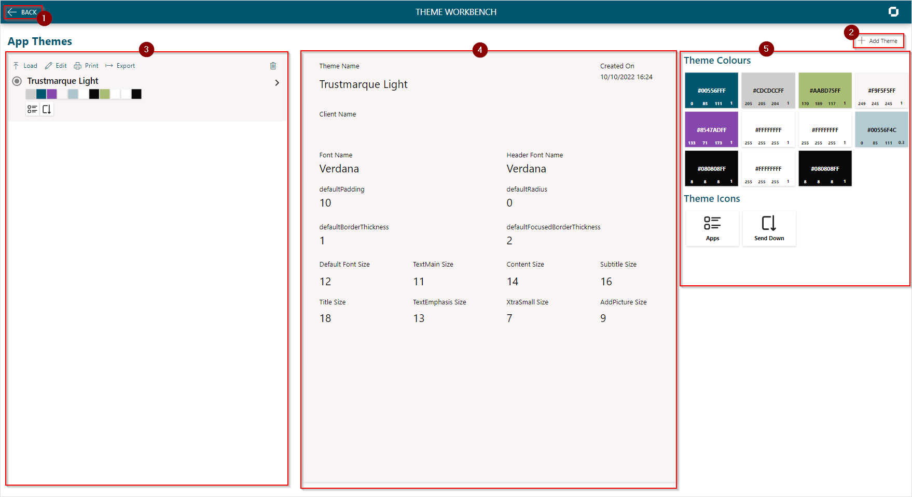

# App Themes Workbench

The App Themes Workbench is navigated to from the Home Screen and is where you create, manage, print and export themes.

1. Navigate back to the Home Screen
2. [Create a New Theme](./create-new-theme.md)
3. App themes gallery
4. Details panel shows the theme settings
5. Colors and Icons gallery shows the themes colors and icons.